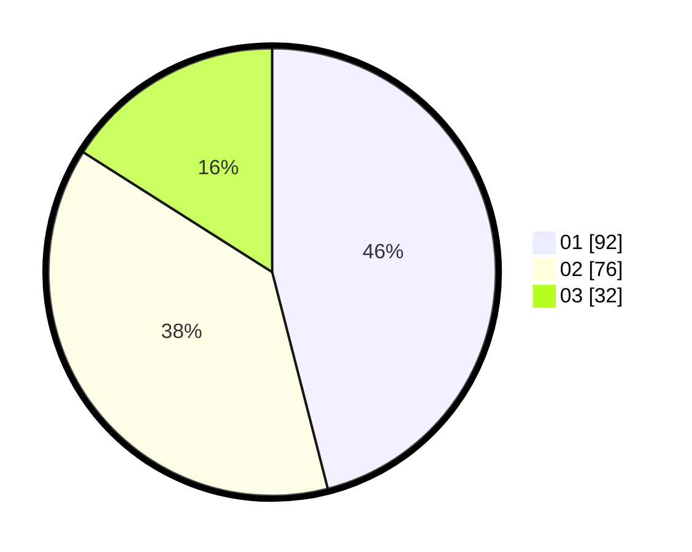

# Hasil

Hasil perolehan suara paslon dapat dilihat pada file paslon-01.txt, paslon-02.txt, dan paslon-03.txt.

Jika tidak ada, artinya data tersebut belum ada pada SIREKAP.

## Perolehan Suara

 * Paslon 01: **92**.
 * Paslon 02: **76**.
 * Paslon 03: **32**.

## Foto C Plano

https://sirekap-obj-formc.kpu.go.id/a0d6/pemilu/ppwp/31/73/08/10/04/3173081004133-20240215-034205--f11efa8b-6f79-4be0-8cee-59f41cf91992.jpg

https://sirekap-obj-formc.kpu.go.id/a0d6/pemilu/ppwp/31/73/08/10/04/3173081004133-20240214-155554--b8d0a825-cfc9-40dd-b32d-e3b11036b970.jpg

https://sirekap-obj-formc.kpu.go.id/a0d6/pemilu/ppwp/31/73/08/10/04/3173081004133-20240215-034233--3b269b86-7f99-4924-a244-f9343bd9ac37.jpg
