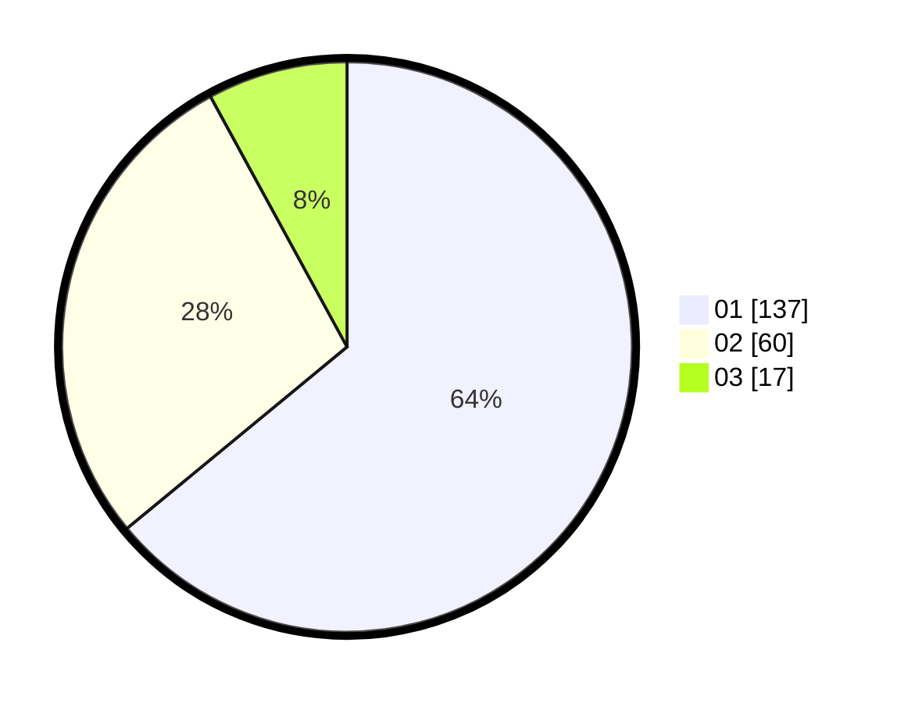

# Hasil

Hasil perolehan suara paslon dapat dilihat pada file paslon-01.txt, paslon-02.txt, dan paslon-03.txt.

Jika tidak ada, artinya data tersebut belum ada pada SIREKAP.

## Perolehan Suara

 * Paslon 01: **137**.
 * Paslon 02: **60**.
 * Paslon 03: **17**.

## Foto C Plano

https://sirekap-obj-formc.kpu.go.id/2825/pemilu/ppwp/31/73/08/10/04/3173081004137-20240215-052223--5e787619-d07e-41d8-ba18-0c8566a15304.jpg

https://sirekap-obj-formc.kpu.go.id/2825/pemilu/ppwp/31/73/08/10/04/3173081004137-20240214-223858--28c61ae6-206c-4e51-b44f-59153b6843af.jpg

https://sirekap-obj-formc.kpu.go.id/2825/pemilu/ppwp/31/73/08/10/04/3173081004137-20240215-011154--82c35bdb-4aca-48eb-9947-ba3cfc313705.jpg

## DATA PEMILIH TETAP

Jumlah pemilih dalam DPT: **281**.
 * L: **139**.
 * P: **142**.

## DATA PENGGUNA HAK PILIH

Jumlah pengguna hak pilih dalam DPT: **212**.
 * L: **99**.
 * P: **113**.

Jumlah pengguna hak pilih dalam DPTb: **2**.
 * L: **2**.
 * P: **0**.

Jumlah pengguna hak pilih dalam DPK: **3**.
 * L: **2**.
 * P: **1**.

Jumlah pengguna hak pilih: **217**.
 * L: **103**.
 * P: **114**.

## JUMLAH SUARA SAH DAN TIDAK SAH

JUMLAH SELURUH SUARA SAH: **214**.

JUMLAH SUARA TIDAK SAH: **3**.

JUMLAH SELURUH SUARA SAH DAN SUARA TIDAK SAH: **217**.
