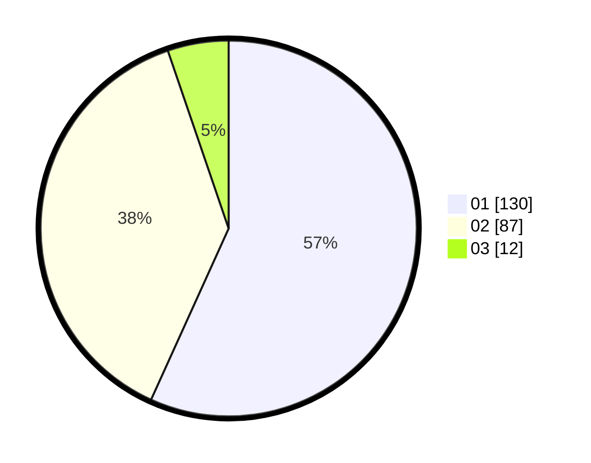

# Hasil

Hasil perolehan suara paslon dapat dilihat pada file paslon-01.txt, paslon-02.txt, dan paslon-03.txt.

Jika tidak ada, artinya data tersebut belum ada pada SIREKAP.

## Perolehan Suara

 * Paslon 01: **130**.
 * Paslon 02: **87**.
 * Paslon 03: **12**.

## Foto C Plano

https://sirekap-obj-formc.kpu.go.id/1d7c/pemilu/ppwp/31/73/08/10/04/3173081004138-20240214-215254--b3000ca4-2934-44f1-8c18-d33ae10f0057.jpg

https://sirekap-obj-formc.kpu.go.id/1d7c/pemilu/ppwp/31/73/08/10/04/3173081004138-20240214-225606--74c6f857-1ec2-435e-a984-1e4c9f028abb.jpg

https://sirekap-obj-formc.kpu.go.id/1d7c/pemilu/ppwp/31/73/08/10/04/3173081004138-20240214-235304--7b77c3a5-14a5-44ce-9153-1903fb1f5812.jpg
