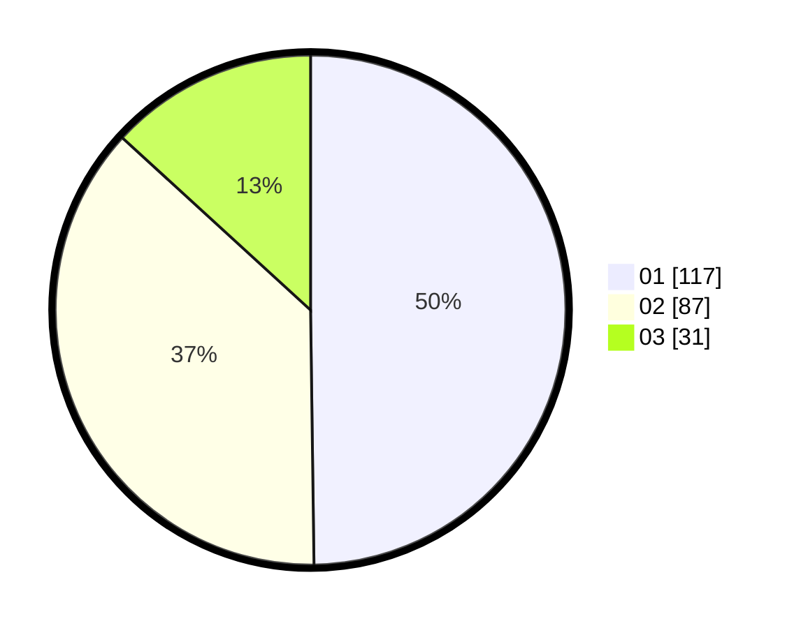

# Hasil

Hasil perolehan suara paslon dapat dilihat pada file paslon-01.txt, paslon-02.txt, dan paslon-03.txt.

Jika tidak ada, artinya data tersebut belum ada pada SIREKAP.

## Perolehan Suara

 * Paslon 01: **117**.
 * Paslon 02: **87**.
 * Paslon 03: **31**.

## Foto C Plano

https://sirekap-obj-formc.kpu.go.id/8244/pemilu/ppwp/31/73/08/10/04/3173081004140-20240214-204530--99e42025-0db4-45a8-a0a3-db4e91a26546.jpg

https://sirekap-obj-formc.kpu.go.id/8244/pemilu/ppwp/31/73/08/10/04/3173081004140-20240214-204619--518b5cc1-fe6f-4547-aca1-92b141d9a8ae.jpg

https://sirekap-obj-formc.kpu.go.id/8244/pemilu/ppwp/31/73/08/10/04/3173081004140-20240214-230321--618cda90-fdae-4d41-9a15-e03a46d38395.jpg
