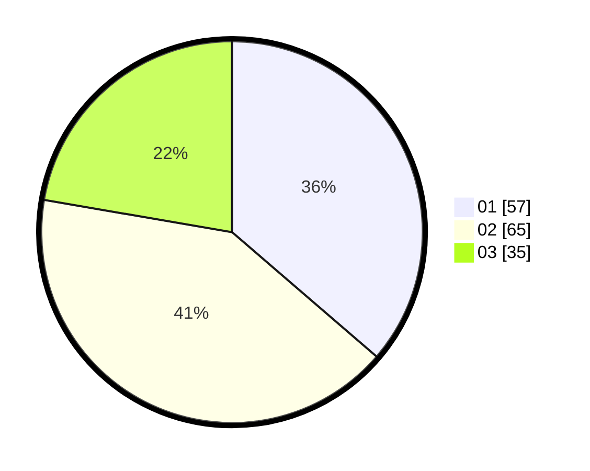

# Hasil

Hasil perolehan suara paslon dapat dilihat pada file paslon-01.txt, paslon-02.txt, dan paslon-03.txt.

Jika tidak ada, artinya data tersebut belum ada pada SIREKAP.

## Perolehan Suara

 * Paslon 01: **57**.
 * Paslon 02: **65**.
 * Paslon 03: **35**.

## Foto C Plano

https://sirekap-obj-formc.kpu.go.id/0e34/pemilu/ppwp/31/73/08/10/04/3173081004142-20240215-005432--40ee69e3-996a-4f8b-ab17-c5680cce5099.jpg

https://sirekap-obj-formc.kpu.go.id/0e34/pemilu/ppwp/31/73/08/10/04/3173081004142-20240215-005518--bb881801-bee1-4a8c-88e0-bcae0293f8c0.jpg

https://sirekap-obj-formc.kpu.go.id/0e34/pemilu/ppwp/31/73/08/10/04/3173081004142-20240215-005601--58050617-028e-45d7-b2d2-f99dde13d889.jpg
