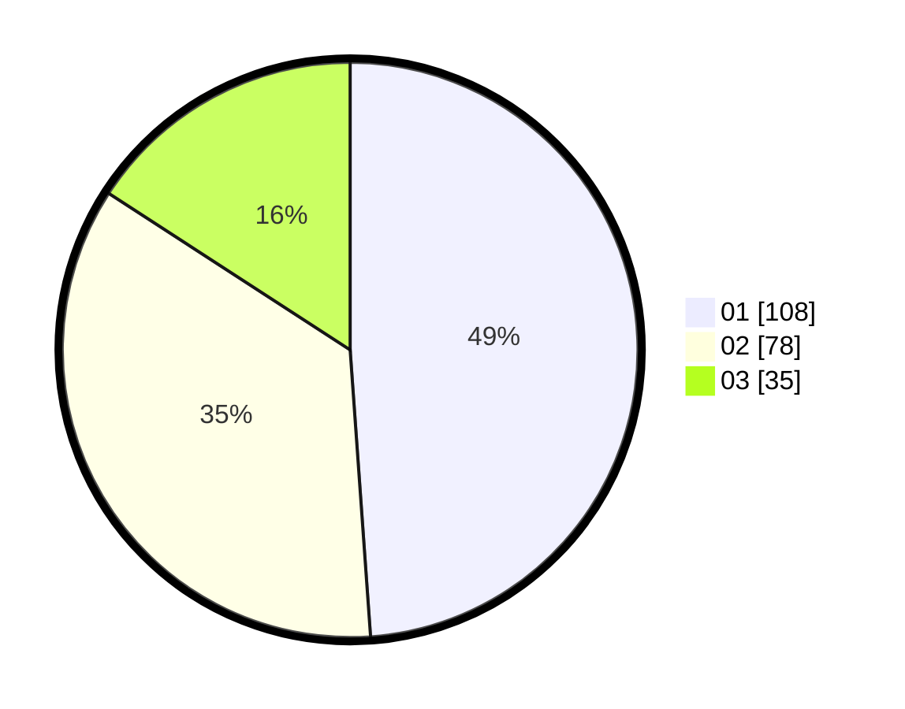

# Hasil

Hasil perolehan suara paslon dapat dilihat pada file paslon-01.txt, paslon-02.txt, dan paslon-03.txt.

Jika tidak ada, artinya data tersebut belum ada pada SIREKAP.

## Perolehan Suara

 * Paslon 01: **108**.
 * Paslon 02: **78**.
 * Paslon 03: **35**.

## Foto C Plano

https://sirekap-obj-formc.kpu.go.id/7be4/pemilu/ppwp/31/73/08/10/04/3173081004143-20240214-234308--de6ad1ca-2e26-4650-be40-9d70b40e2c3d.jpg

https://sirekap-obj-formc.kpu.go.id/7be4/pemilu/ppwp/31/73/08/10/04/3173081004143-20240214-234348--0477e195-903c-4118-84bc-5bec3d1abad1.jpg

https://sirekap-obj-formc.kpu.go.id/7be4/pemilu/ppwp/31/73/08/10/04/3173081004143-20240214-234450--20f63339-c32b-4c50-ab0f-456b0485f2cd.jpg

## DATA PEMILIH TETAP

Jumlah pemilih dalam DPT: **270**.
 * L: **133**.
 * P: **137**.

## DATA PENGGUNA HAK PILIH

Jumlah pengguna hak pilih dalam DPT: **219**.
 * L: **108**.
 * P: **111**.

Jumlah pengguna hak pilih dalam DPTb: **3**.
 * L: **1**.
 * P: **2**.

Jumlah pengguna hak pilih dalam DPK: **0**.
 * L: **0**.
 * P: **0**.

Jumlah pengguna hak pilih: **222**.
 * L: **109**.
 * P: **113**.

## JUMLAH SUARA SAH DAN TIDAK SAH

JUMLAH SELURUH SUARA SAH: **221**.

JUMLAH SUARA TIDAK SAH: **1**.

JUMLAH SELURUH SUARA SAH DAN SUARA TIDAK SAH: **222**.
