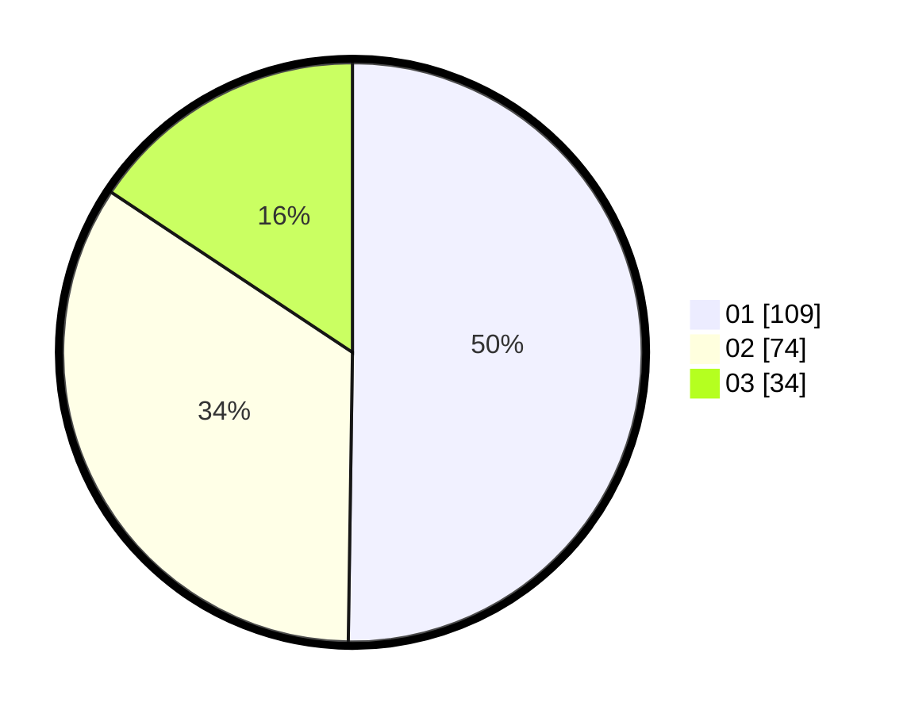

# Hasil

Hasil perolehan suara paslon dapat dilihat pada file paslon-01.txt, paslon-02.txt, dan paslon-03.txt.

Jika tidak ada, artinya data tersebut belum ada pada SIREKAP.

## Perolehan Suara

 * Paslon 01: **109**.
 * Paslon 02: **74**.
 * Paslon 03: **34**.

## Foto C Plano

https://sirekap-obj-formc.kpu.go.id/cc36/pemilu/ppwp/31/73/08/10/04/3173081004145-20240214-155925--5032d058-365b-4473-b54b-6b48a8078316.jpg

https://sirekap-obj-formc.kpu.go.id/cc36/pemilu/ppwp/31/73/08/10/04/3173081004145-20240214-155727--d0bec201-0b09-4dd6-8819-bd9cc66c87fc.jpg

https://sirekap-obj-formc.kpu.go.id/cc36/pemilu/ppwp/31/73/08/10/04/3173081004145-20240214-160100--74f57b7b-df65-4d66-b445-678cf605b91c.jpg
