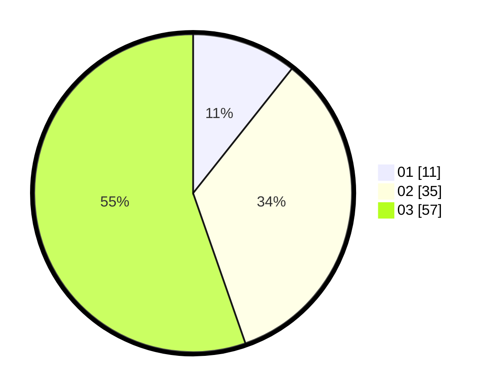

# Hasil

Hasil perolehan suara paslon dapat dilihat pada file paslon-01.txt, paslon-02.txt, dan paslon-03.txt.

Jika tidak ada, artinya data tersebut belum ada pada SIREKAP.

## Perolehan Suara

 * Paslon 01: **11**.
 * Paslon 02: **35**.
 * Paslon 03: **57**.

## Foto C Plano

https://sirekap-obj-formc.kpu.go.id/6d9f/pemilu/ppwp/31/73/08/10/04/3173081004148-20240216-003937--7880e4c0-06ee-44ee-862a-4eb2c7cfb4b5.jpg

https://sirekap-obj-formc.kpu.go.id/6d9f/pemilu/ppwp/31/73/08/10/04/3173081004148-20240216-003939--d19a98e5-fbb2-473e-b981-98351a2bcd8d.jpg

https://sirekap-obj-formc.kpu.go.id/6d9f/pemilu/ppwp/31/73/08/10/04/3173081004148-20240216-003938--44964408-9914-4141-af07-8536c529db72.jpg

## DATA PEMILIH TETAP

Jumlah pemilih dalam DPT: **105**.
 * L: **48**.
 * P: **57**.

## DATA PENGGUNA HAK PILIH

Jumlah pengguna hak pilih dalam DPT: **94**.
 * L: **41**.
 * P: **53**.

Jumlah pengguna hak pilih dalam DPTb: **7**.
 * L: **5**.
 * P: **2**.

Jumlah pengguna hak pilih dalam DPK: **4**.
 * L: **2**.
 * P: **2**.

Jumlah pengguna hak pilih: **105**.
 * L: **48**.
 * P: **57**.

## JUMLAH SUARA SAH DAN TIDAK SAH

JUMLAH SELURUH SUARA SAH: **103**.

JUMLAH SUARA TIDAK SAH: **2**.

JUMLAH SELURUH SUARA SAH DAN SUARA TIDAK SAH: **105**.
