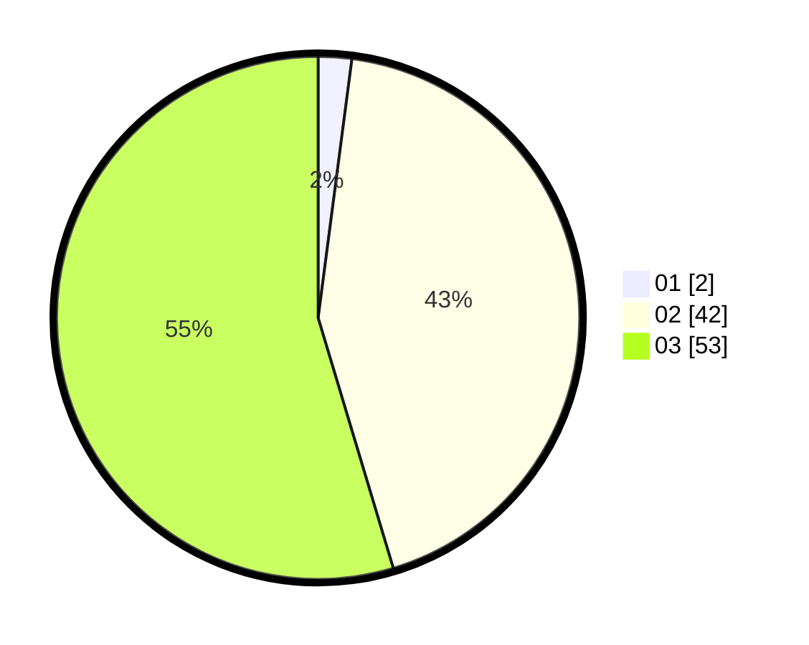

# Hasil

Hasil perolehan suara paslon dapat dilihat pada file paslon-01.txt, paslon-02.txt, dan paslon-03.txt.

Jika tidak ada, artinya data tersebut belum ada pada SIREKAP.

## Perolehan Suara

 * Paslon 01: **2**.
 * Paslon 02: **42**.
 * Paslon 03: **53**.

## Foto C Plano

https://sirekap-obj-formc.kpu.go.id/de8c/pemilu/ppwp/31/73/08/10/04/3173081004151-20240214-160107--bf68f04e-cf04-4136-8828-c1435e5be6e0.jpg

https://sirekap-obj-formc.kpu.go.id/de8c/pemilu/ppwp/31/73/08/10/04/3173081004151-20240214-190540--7853f12a-c814-4637-9847-db06cc2e4cae.jpg

https://sirekap-obj-formc.kpu.go.id/de8c/pemilu/ppwp/31/73/08/10/04/3173081004151-20240214-190744--a2090e62-14b5-4898-b822-55cc4f7b0ff3.jpg

## DATA PEMILIH TETAP

Jumlah pemilih dalam DPT: **124**.
 * L: **58**.
 * P: **55**.

## DATA PENGGUNA HAK PILIH

Jumlah pengguna hak pilih dalam DPT: **41**.
 * L: **42**.
 * P: **49**.

Jumlah pengguna hak pilih dalam DPTb: **2**.
 * L: **552**.
 * P: **555**.

Jumlah pengguna hak pilih dalam DPK: **4**.
 * L: **7**.
 * P: **1**.

Jumlah pengguna hak pilih: **47**.
 * L: **47**.
 * P: **50**.

## JUMLAH SUARA SAH DAN TIDAK SAH

JUMLAH SELURUH SUARA SAH: **47**.

JUMLAH SUARA TIDAK SAH: **400**.

JUMLAH SELURUH SUARA SAH DAN SUARA TIDAK SAH: **47**.
