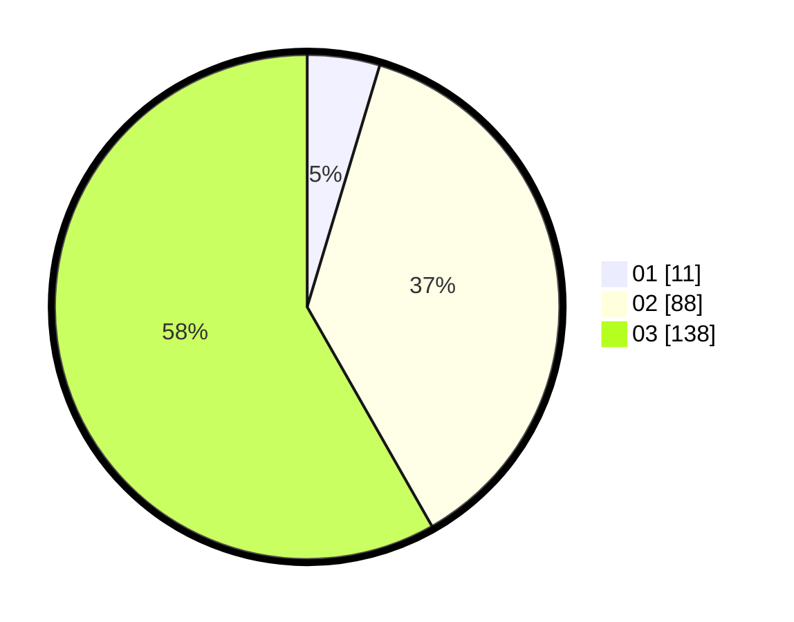

# Hasil

Hasil perolehan suara paslon dapat dilihat pada file paslon-01.txt, paslon-02.txt, dan paslon-03.txt.

Jika tidak ada, artinya data tersebut belum ada pada SIREKAP.

## Perolehan Suara

 * Paslon 01: **11**.
 * Paslon 02: **88**.
 * Paslon 03: **138**.

## Foto C Plano

https://sirekap-obj-formc.kpu.go.id/41df/pemilu/ppwp/31/73/08/10/04/3173081004153-20240215-224037--411f2b01-7cd6-4cbb-a3aa-35da99794487.jpg

https://sirekap-obj-formc.kpu.go.id/41df/pemilu/ppwp/31/73/08/10/04/3173081004153-20240215-224043--2b3d23ce-826d-4d32-8058-a1934fce8709.jpg

https://sirekap-obj-formc.kpu.go.id/41df/pemilu/ppwp/31/73/08/10/04/3173081004153-20240215-224041--71089fe6-8b25-4f62-a7d1-96863429e4f1.jpg

## DATA PEMILIH TETAP

Jumlah pemilih dalam DPT: **271**.
 * L: **127**.
 * P: **144**.

## DATA PENGGUNA HAK PILIH

Jumlah pengguna hak pilih dalam DPT: **195**.
 * L: **96**.
 * P: **99**.

Jumlah pengguna hak pilih dalam DPTb: **42**.
 * L: **11**.
 * P: **31**.

Jumlah pengguna hak pilih dalam DPK: **1**.
 * L: **1**.
 * P: **0**.

Jumlah pengguna hak pilih: **238**.
 * L: **108**.
 * P: **130**.

## JUMLAH SUARA SAH DAN TIDAK SAH

JUMLAH SELURUH SUARA SAH: **237**.

JUMLAH SUARA TIDAK SAH: **1**.

JUMLAH SELURUH SUARA SAH DAN SUARA TIDAK SAH: **238**.
