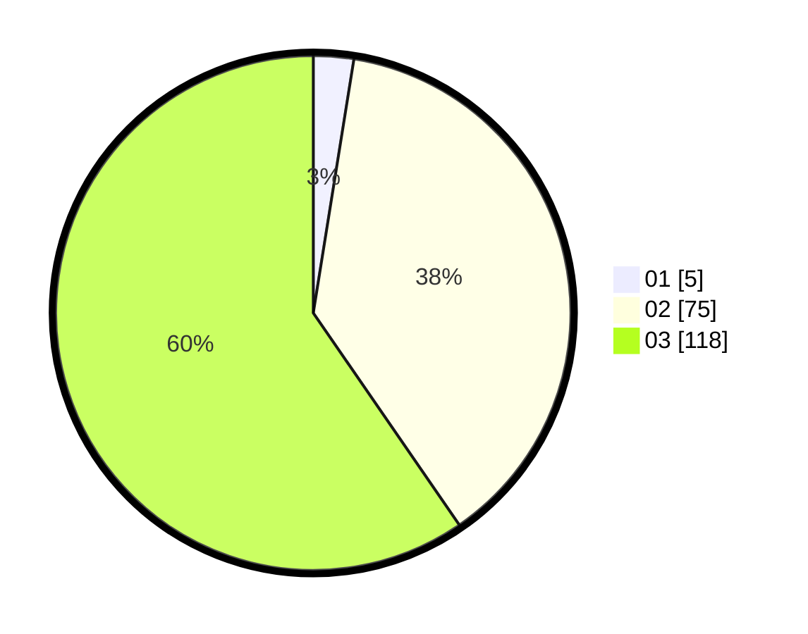

# Hasil

Hasil perolehan suara paslon dapat dilihat pada file paslon-01.txt, paslon-02.txt, dan paslon-03.txt.

Jika tidak ada, artinya data tersebut belum ada pada SIREKAP.

## Perolehan Suara

 * Paslon 01: **5**.
 * Paslon 02: **75**.
 * Paslon 03: **118**.

## Foto C Plano

https://sirekap-obj-formc.kpu.go.id/5d50/pemilu/ppwp/31/73/08/10/04/3173081004156-20240214-230501--330a699a-a2b0-4051-94cb-2710773b4718.jpg

https://sirekap-obj-formc.kpu.go.id/5d50/pemilu/ppwp/31/73/08/10/04/3173081004156-20240214-230623--5d0541ad-0a31-4c74-80ce-38a417b54b8c.jpg

https://sirekap-obj-formc.kpu.go.id/5d50/pemilu/ppwp/31/73/08/10/04/3173081004156-20240214-230805--bdb33429-1c3a-453b-a067-ce9078dc5f2e.jpg
