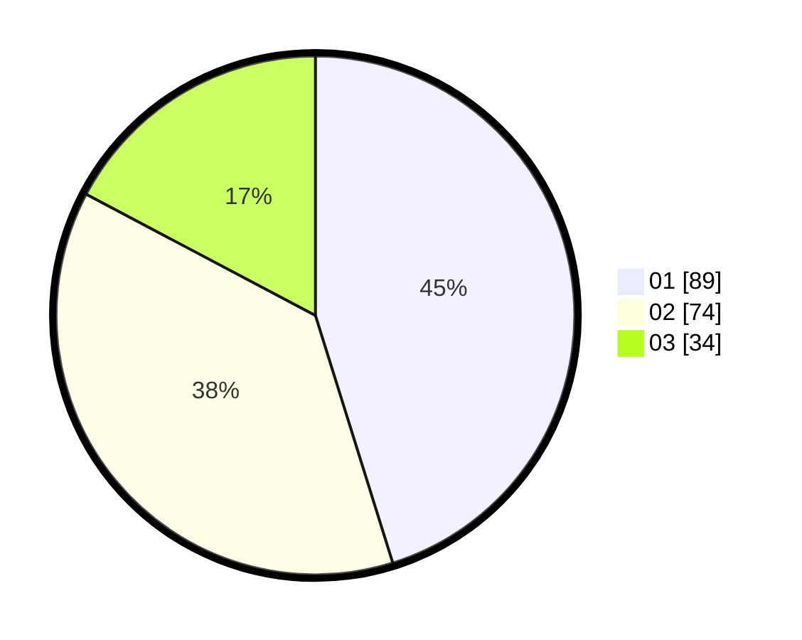

# Hasil

Hasil perolehan suara paslon dapat dilihat pada file paslon-01.txt, paslon-02.txt, dan paslon-03.txt.

Jika tidak ada, artinya data tersebut belum ada pada SIREKAP.

## Perolehan Suara

 * Paslon 01: **89**.
 * Paslon 02: **74**.
 * Paslon 03: **34**.

## Foto C Plano

https://sirekap-obj-formc.kpu.go.id/99c6/pemilu/ppwp/31/73/08/10/05/3173081005006-20240215-211051--50f2f4ee-8c56-4509-bfc7-a9db1e734e21.jpg

https://sirekap-obj-formc.kpu.go.id/99c6/pemilu/ppwp/31/73/08/10/05/3173081005006-20240215-211054--7150e71a-67ab-4d25-8dc1-38efd8d68e06.jpg

https://sirekap-obj-formc.kpu.go.id/99c6/pemilu/ppwp/31/73/08/10/05/3173081005006-20240215-211052--3769081e-6fa7-4bb1-b11e-12bf005d7672.jpg

## DATA PEMILIH TETAP

Jumlah pemilih dalam DPT: **272**.
 * L: **133**.
 * P: **139**.

## DATA PENGGUNA HAK PILIH

Jumlah pengguna hak pilih dalam DPT: **197**.
 * L: **95**.
 * P: **102**.

Jumlah pengguna hak pilih dalam DPTb: **0**.
 * L: **0**.
 * P: **0**.

Jumlah pengguna hak pilih dalam DPK: **2**.
 * L: **1**.
 * P: **1**.

Jumlah pengguna hak pilih: **199**.
 * L: **96**.
 * P: **103**.

## JUMLAH SUARA SAH DAN TIDAK SAH

JUMLAH SELURUH SUARA SAH: **197**.

JUMLAH SUARA TIDAK SAH: **2**.

JUMLAH SELURUH SUARA SAH DAN SUARA TIDAK SAH: **199**.
