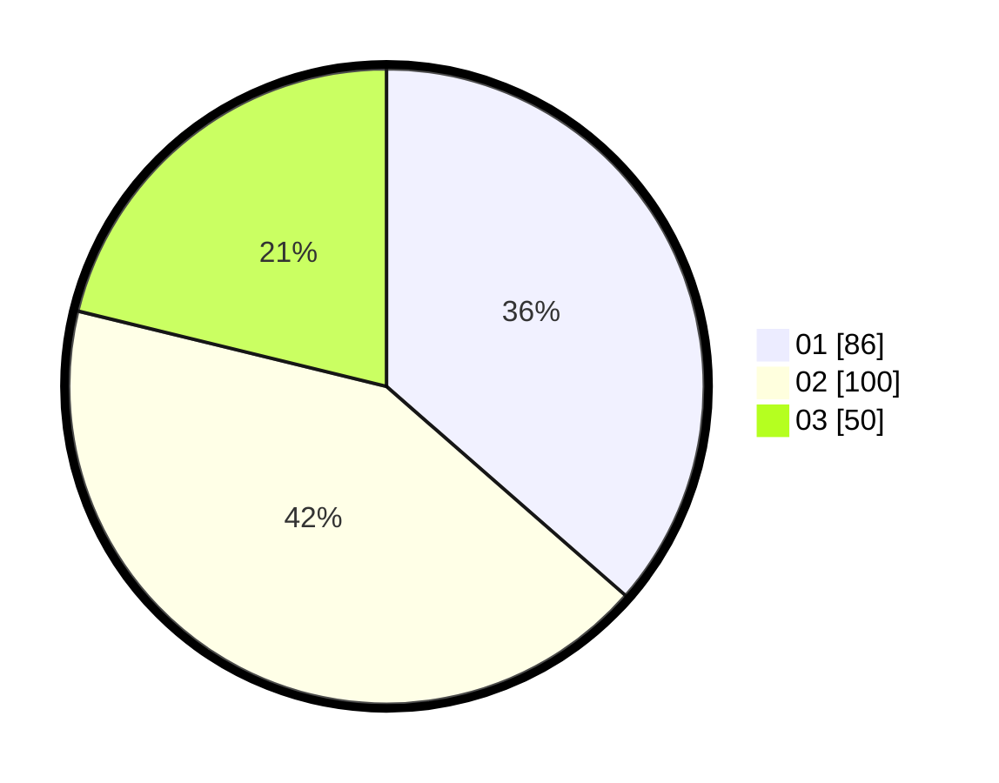

# Hasil

Hasil perolehan suara paslon dapat dilihat pada file paslon-01.txt, paslon-02.txt, dan paslon-03.txt.

Jika tidak ada, artinya data tersebut belum ada pada SIREKAP.

## Perolehan Suara

 * Paslon 01: **86**.
 * Paslon 02: **100**.
 * Paslon 03: **50**.

## Foto C Plano

https://sirekap-obj-formc.kpu.go.id/cda9/pemilu/ppwp/31/73/08/10/05/3173081005010-20240214-190555--dfd3108c-c003-48ae-b486-730659cae578.jpg

https://sirekap-obj-formc.kpu.go.id/cda9/pemilu/ppwp/31/73/08/10/05/3173081005010-20240214-190606--f4af1d40-5cf6-402c-b5a0-dffbb4c64b29.jpg

https://sirekap-obj-formc.kpu.go.id/cda9/pemilu/ppwp/31/73/08/10/05/3173081005010-20240214-190614--a647874d-7d5c-4d47-b8f8-b6fbce985470.jpg
