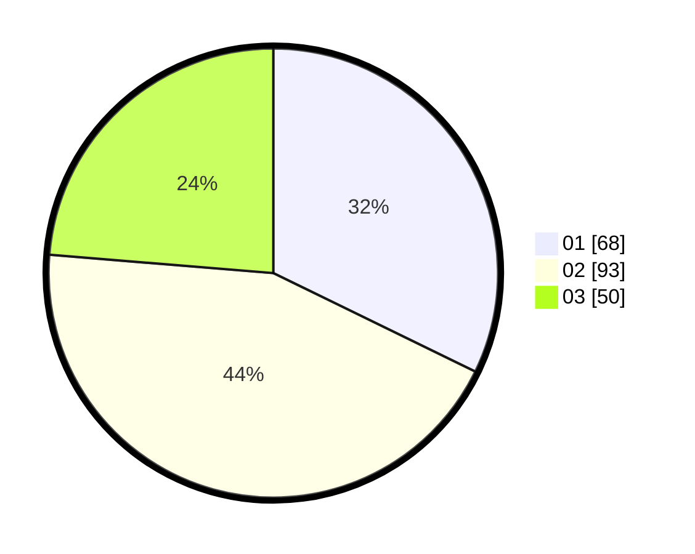

# Hasil

Hasil perolehan suara paslon dapat dilihat pada file paslon-01.txt, paslon-02.txt, dan paslon-03.txt.

Jika tidak ada, artinya data tersebut belum ada pada SIREKAP.

## Perolehan Suara

 * Paslon 01: **68**.
 * Paslon 02: **93**.
 * Paslon 03: **50**.

## Foto C Plano

https://sirekap-obj-formc.kpu.go.id/8f85/pemilu/ppwp/31/73/08/10/05/3173081005020-20240216-140726--c9fde7d6-6892-40a3-a52f-56511a55edd1.jpg

https://sirekap-obj-formc.kpu.go.id/8f85/pemilu/ppwp/31/73/08/10/05/3173081005020-20240216-140728--21d2f5f5-438e-465c-a98d-673eb82ea623.jpg

https://sirekap-obj-formc.kpu.go.id/8f85/pemilu/ppwp/31/73/08/10/05/3173081005020-20240216-140727--539b8ad0-4e3b-45ef-93db-ae2b2e549feb.jpg

## DATA PEMILIH TETAP

Jumlah pemilih dalam DPT: **272**.
 * L: **137**.
 * P: **135**.

## DATA PENGGUNA HAK PILIH

Jumlah pengguna hak pilih dalam DPT: **214**.
 * L: **109**.
 * P: **105**.

Jumlah pengguna hak pilih dalam DPTb: **1**.
 * L: **1**.
 * P: **0**.

Jumlah pengguna hak pilih dalam DPK: **0**.
 * L: **0**.
 * P: **0**.

Jumlah pengguna hak pilih: **215**.
 * L: **110**.
 * P: **105**.

## JUMLAH SUARA SAH DAN TIDAK SAH

JUMLAH SELURUH SUARA SAH: **211**.

JUMLAH SUARA TIDAK SAH: **4**.

JUMLAH SELURUH SUARA SAH DAN SUARA TIDAK SAH: **215**.
