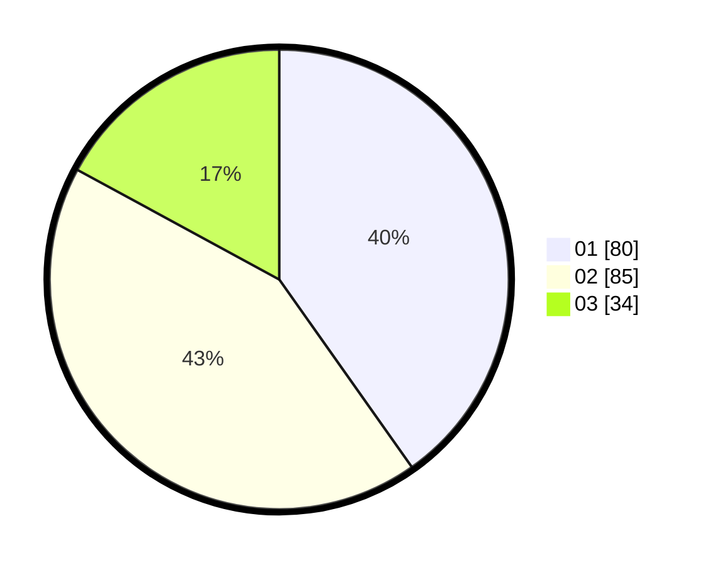

# Hasil

Hasil perolehan suara paslon dapat dilihat pada file paslon-01.txt, paslon-02.txt, dan paslon-03.txt.

Jika tidak ada, artinya data tersebut belum ada pada SIREKAP.

## Perolehan Suara

 * Paslon 01: **80**.
 * Paslon 02: **85**.
 * Paslon 03: **34**.

## Foto C Plano

https://sirekap-obj-formc.kpu.go.id/630b/pemilu/ppwp/31/73/08/10/05/3173081005021-20240214-190205--ae7717eb-4240-4f56-b4b3-0766b646eeee.jpg

https://sirekap-obj-formc.kpu.go.id/630b/pemilu/ppwp/31/73/08/10/05/3173081005021-20240214-185840--ef662331-fbc1-4134-a1b2-a7ce9a3a82a7.jpg

https://sirekap-obj-formc.kpu.go.id/630b/pemilu/ppwp/31/73/08/10/05/3173081005021-20240214-191716--a7d858e7-1872-4be0-aa4e-8e30fcef9add.jpg

## DATA PEMILIH TETAP

Jumlah pemilih dalam DPT: **274**.
 * L: **133**.
 * P: **141**.

## DATA PENGGUNA HAK PILIH

Jumlah pengguna hak pilih dalam DPT: **200**.
 * L: **92**.
 * P: **108**.

Jumlah pengguna hak pilih dalam DPTb: **0**.
 * L: **0**.
 * P: **0**.

Jumlah pengguna hak pilih dalam DPK: **1**.
 * L: **0**.
 * P: **1**.

Jumlah pengguna hak pilih: **201**.
 * L: **92**.
 * P: **109**.

## JUMLAH SUARA SAH DAN TIDAK SAH

JUMLAH SELURUH SUARA SAH: **199**.

JUMLAH SUARA TIDAK SAH: **2**.

JUMLAH SELURUH SUARA SAH DAN SUARA TIDAK SAH: **201**.
