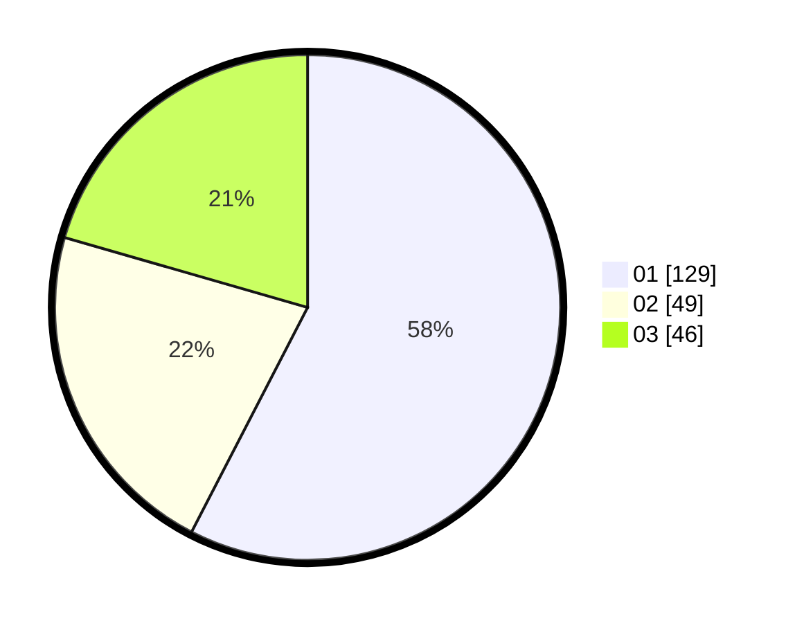

# Hasil

Hasil perolehan suara paslon dapat dilihat pada file paslon-01.txt, paslon-02.txt, dan paslon-03.txt.

Jika tidak ada, artinya data tersebut belum ada pada SIREKAP.

## Perolehan Suara

 * Paslon 01: **129**.
 * Paslon 02: **49**.
 * Paslon 03: **46**.

## Foto C Plano

https://sirekap-obj-formc.kpu.go.id/fcf1/pemilu/ppwp/31/73/08/10/05/3173081005023-20240214-200742--c0737262-11e9-49fb-9168-18b51cbe703b.jpg

https://sirekap-obj-formc.kpu.go.id/fcf1/pemilu/ppwp/31/73/08/10/05/3173081005023-20240214-200922--efc29f88-c2bf-4b2b-add6-f5a4a72213b1.jpg

https://sirekap-obj-formc.kpu.go.id/fcf1/pemilu/ppwp/31/73/08/10/05/3173081005023-20240214-201253--39e55111-4e44-4ed5-b888-53ad91b3ca29.jpg
