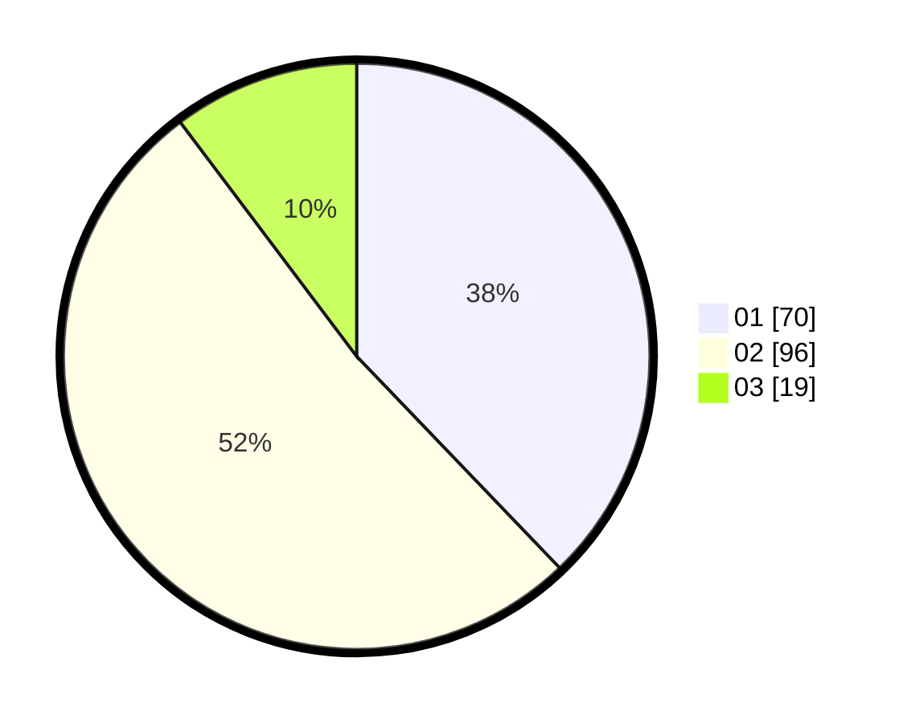

# Hasil

Hasil perolehan suara paslon dapat dilihat pada file paslon-01.txt, paslon-02.txt, dan paslon-03.txt.

Jika tidak ada, artinya data tersebut belum ada pada SIREKAP.

## Perolehan Suara

 * Paslon 01: **70**.
 * Paslon 02: **96**.
 * Paslon 03: **19**.

## Foto C Plano

https://sirekap-obj-formc.kpu.go.id/3be3/pemilu/ppwp/31/73/08/10/05/3173081005024-20240214-230547--50238b70-ee67-4809-99ec-becc2a327450.jpg

https://sirekap-obj-formc.kpu.go.id/3be3/pemilu/ppwp/31/73/08/10/05/3173081005024-20240214-230739--fa122e1a-fb50-4a15-8436-ae5c1f0c85cb.jpg

https://sirekap-obj-formc.kpu.go.id/3be3/pemilu/ppwp/31/73/08/10/05/3173081005024-20240214-230905--fb4d8e65-9cc8-404d-8bbf-63d71b00a6a6.jpg
