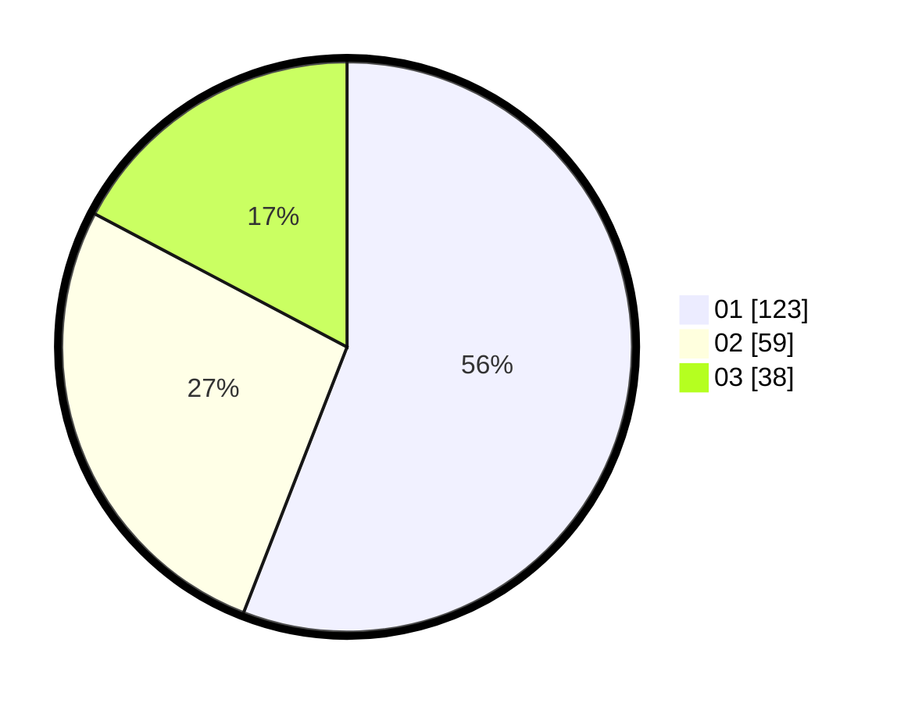

# Hasil

Hasil perolehan suara paslon dapat dilihat pada file paslon-01.txt, paslon-02.txt, dan paslon-03.txt.

Jika tidak ada, artinya data tersebut belum ada pada SIREKAP.

## Perolehan Suara

 * Paslon 01: **123**.
 * Paslon 02: **59**.
 * Paslon 03: **38**.

## Foto C Plano

https://sirekap-obj-formc.kpu.go.id/d00e/pemilu/ppwp/31/73/08/10/05/3173081005027-20240214-155747--930d4750-5852-43c3-943d-d0dcfd09d2a8.jpg

https://sirekap-obj-formc.kpu.go.id/d00e/pemilu/ppwp/31/73/08/10/05/3173081005027-20240214-160135--87789bbf-9900-4e38-8e45-16860010dc78.jpg
