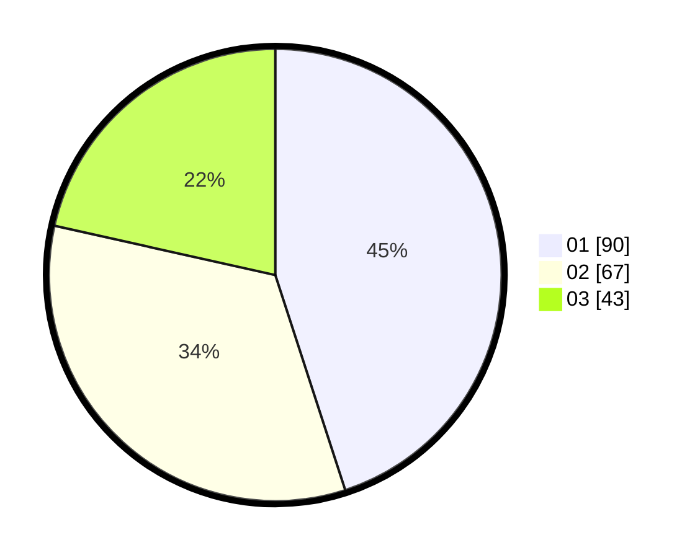

# Hasil

Hasil perolehan suara paslon dapat dilihat pada file paslon-01.txt, paslon-02.txt, dan paslon-03.txt.

Jika tidak ada, artinya data tersebut belum ada pada SIREKAP.

## Perolehan Suara

 * Paslon 01: **90**.
 * Paslon 02: **67**.
 * Paslon 03: **43**.

## Foto C Plano

https://sirekap-obj-formc.kpu.go.id/c036/pemilu/ppwp/31/73/08/10/05/3173081005029-20240214-210135--225851c5-f15b-4863-97a1-c959ffafc060.jpg

https://sirekap-obj-formc.kpu.go.id/c036/pemilu/ppwp/31/73/08/10/05/3173081005029-20240214-210221--bf9790ec-2a34-4f1d-821a-938e49cb6e1b.jpg

https://sirekap-obj-formc.kpu.go.id/c036/pemilu/ppwp/31/73/08/10/05/3173081005029-20240214-210314--699988b6-be09-4204-b748-28950474a912.jpg

## DATA PEMILIH TETAP

Jumlah pemilih dalam DPT: **284**.
 * L: **135**.
 * P: **149**.

## DATA PENGGUNA HAK PILIH

Jumlah pengguna hak pilih dalam DPT: **199**.
 * L: **90**.
 * P: **109**.

Jumlah pengguna hak pilih dalam DPTb: **2**.
 * L: **0**.
 * P: **2**.

Jumlah pengguna hak pilih dalam DPK: **8**.
 * L: **6**.
 * P: **2**.

Jumlah pengguna hak pilih: **209**.
 * L: **96**.
 * P: **113**.

## JUMLAH SUARA SAH DAN TIDAK SAH

JUMLAH SELURUH SUARA SAH: **200**.

JUMLAH SUARA TIDAK SAH: **9**.

JUMLAH SELURUH SUARA SAH DAN SUARA TIDAK SAH: **209**.
