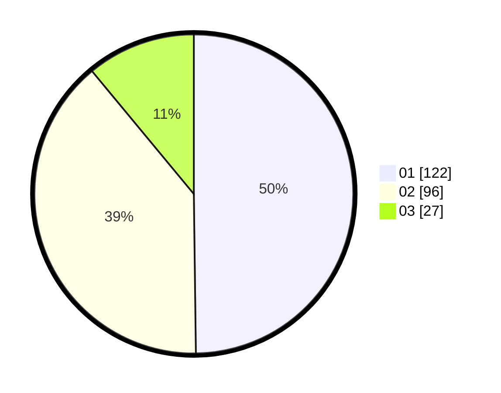

# Hasil

Hasil perolehan suara paslon dapat dilihat pada file paslon-01.txt, paslon-02.txt, dan paslon-03.txt.

Jika tidak ada, artinya data tersebut belum ada pada SIREKAP.

## Perolehan Suara

 * Paslon 01: **122**.
 * Paslon 02: **96**.
 * Paslon 03: **27**.

## Foto C Plano

https://sirekap-obj-formc.kpu.go.id/0aa8/pemilu/ppwp/31/73/08/10/05/3173081005031-20240214-205050--9144585f-8fca-417a-a14f-304e628b08e2.jpg

https://sirekap-obj-formc.kpu.go.id/0aa8/pemilu/ppwp/31/73/08/10/05/3173081005031-20240214-230357--4b04069e-d8ff-4f87-a7f8-9576e12f417d.jpg

https://sirekap-obj-formc.kpu.go.id/0aa8/pemilu/ppwp/31/73/08/10/05/3173081005031-20240214-205445--3f900a78-81ec-4b3a-bdba-3b64e624710c.jpg

## DATA PEMILIH TETAP

Jumlah pemilih dalam DPT: **294**.
 * L: **142**.
 * P: **152**.

## DATA PENGGUNA HAK PILIH

Jumlah pengguna hak pilih dalam DPT: **243**.
 * L: **117**.
 * P: **126**.

Jumlah pengguna hak pilih dalam DPTb: **4**.
 * L: **2**.
 * P: **2**.

Jumlah pengguna hak pilih dalam DPK: **0**.
 * L: **0**.
 * P: **0**.

Jumlah pengguna hak pilih: **247**.
 * L: **119**.
 * P: **128**.

## JUMLAH SUARA SAH DAN TIDAK SAH

JUMLAH SELURUH SUARA SAH: **245**.

JUMLAH SUARA TIDAK SAH: **2**.

JUMLAH SELURUH SUARA SAH DAN SUARA TIDAK SAH: **247**.
