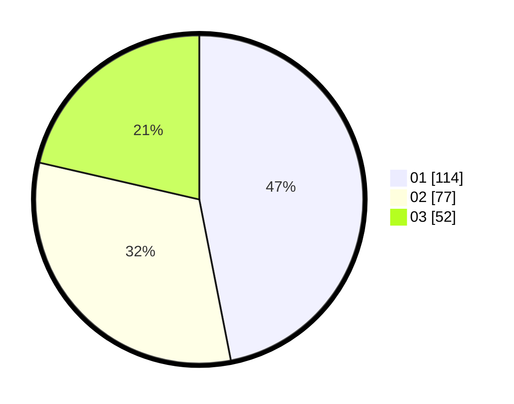

# Hasil

Hasil perolehan suara paslon dapat dilihat pada file paslon-01.txt, paslon-02.txt, dan paslon-03.txt.

Jika tidak ada, artinya data tersebut belum ada pada SIREKAP.

## Perolehan Suara

 * Paslon 01: **114**.
 * Paslon 02: **77**.
 * Paslon 03: **52**.

## Foto C Plano

https://sirekap-obj-formc.kpu.go.id/e2ee/pemilu/ppwp/31/73/08/10/05/3173081005036-20240214-194705--78f58d9d-b41e-436a-9476-cb952708f35a.jpg

https://sirekap-obj-formc.kpu.go.id/e2ee/pemilu/ppwp/31/73/08/10/05/3173081005036-20240214-201459--24651d14-5ffa-4b13-82db-2d2c06a2eaf9.jpg

https://sirekap-obj-formc.kpu.go.id/e2ee/pemilu/ppwp/31/73/08/10/05/3173081005036-20240214-194842--63f269e5-3c66-4ce3-8071-47ad45660c94.jpg

## DATA PEMILIH TETAP

Jumlah pemilih dalam DPT: **290**.
 * L: **145**.
 * P: **145**.

## DATA PENGGUNA HAK PILIH

Jumlah pengguna hak pilih dalam DPT: **239**.
 * L: **114**.
 * P: **125**.

Jumlah pengguna hak pilih dalam DPTb: **1**.
 * L: **0**.
 * P: **1**.

Jumlah pengguna hak pilih dalam DPK: **5**.
 * L: **2**.
 * P: **3**.

Jumlah pengguna hak pilih: **245**.
 * L: **116**.
 * P: **129**.

## JUMLAH SUARA SAH DAN TIDAK SAH

JUMLAH SELURUH SUARA SAH: **243**.

JUMLAH SUARA TIDAK SAH: **2**.

JUMLAH SELURUH SUARA SAH DAN SUARA TIDAK SAH: **245**.
