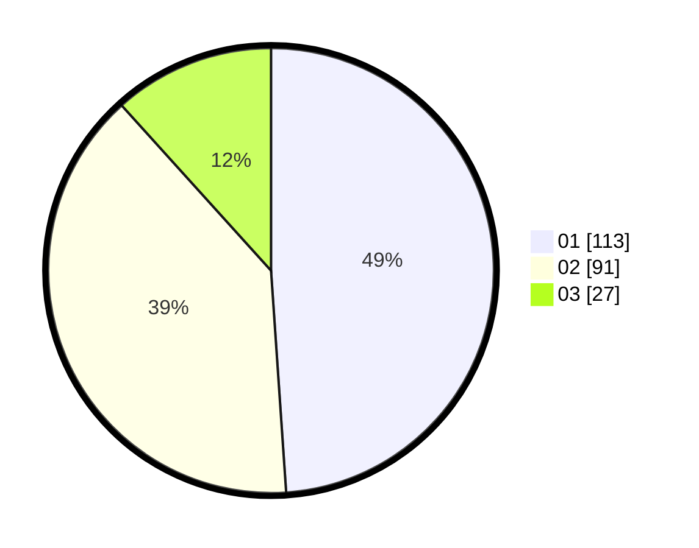

# Hasil

Hasil perolehan suara paslon dapat dilihat pada file paslon-01.txt, paslon-02.txt, dan paslon-03.txt.

Jika tidak ada, artinya data tersebut belum ada pada SIREKAP.

## Perolehan Suara

 * Paslon 01: **113**.
 * Paslon 02: **91**.
 * Paslon 03: **27**.

## Foto C Plano

https://sirekap-obj-formc.kpu.go.id/bd35/pemilu/ppwp/31/73/08/10/05/3173081005039-20240214-194013--2d7028c7-4840-49ef-894e-f4749b3af805.jpg

https://sirekap-obj-formc.kpu.go.id/bd35/pemilu/ppwp/31/73/08/10/05/3173081005039-20240214-194150--478b9f66-966c-47c0-85ed-6ca6bac59bf2.jpg

https://sirekap-obj-formc.kpu.go.id/bd35/pemilu/ppwp/31/73/08/10/05/3173081005039-20240214-194319--908fc6de-b8eb-4136-bbe2-2c438e9ebde6.jpg
