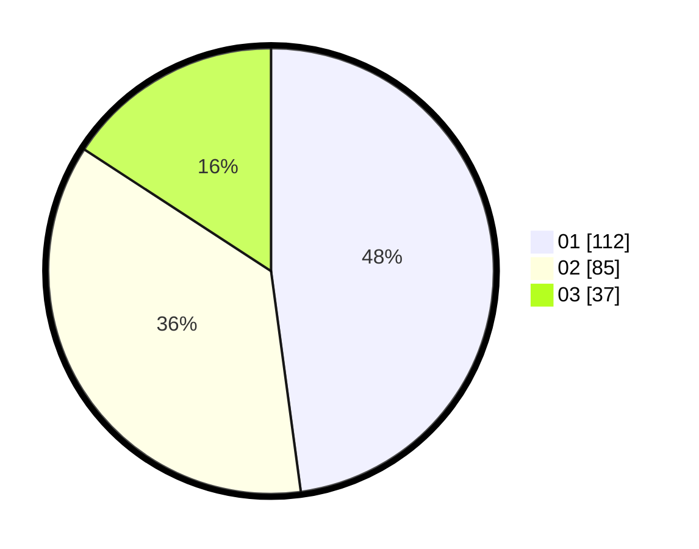

# Hasil

Hasil perolehan suara paslon dapat dilihat pada file paslon-01.txt, paslon-02.txt, dan paslon-03.txt.

Jika tidak ada, artinya data tersebut belum ada pada SIREKAP.

## Perolehan Suara

 * Paslon 01: **112**.
 * Paslon 02: **85**.
 * Paslon 03: **37**.

## Foto C Plano

https://sirekap-obj-formc.kpu.go.id/e382/pemilu/ppwp/31/73/08/10/05/3173081005041-20240214-184807--f492fe44-66f7-4a72-9790-383a78ac5c3a.jpg

https://sirekap-obj-formc.kpu.go.id/e382/pemilu/ppwp/31/73/08/10/05/3173081005041-20240214-184851--af79545f-13b2-468a-882b-8657d5af4a94.jpg

https://sirekap-obj-formc.kpu.go.id/e382/pemilu/ppwp/31/73/08/10/05/3173081005041-20240214-184945--6936697c-ff80-42e0-8df7-eab199df2a91.jpg

## DATA PEMILIH TETAP

Jumlah pemilih dalam DPT: **284**.
 * L: **141**.
 * P: **143**.

## DATA PENGGUNA HAK PILIH

Jumlah pengguna hak pilih dalam DPT: **232**.
 * L: **113**.
 * P: **119**.

Jumlah pengguna hak pilih dalam DPTb: **2**.
 * L: **1**.
 * P: **1**.

Jumlah pengguna hak pilih dalam DPK: **3**.
 * L: **2**.
 * P: **1**.

Jumlah pengguna hak pilih: **237**.
 * L: **116**.
 * P: **121**.

## JUMLAH SUARA SAH DAN TIDAK SAH

JUMLAH SELURUH SUARA SAH: **234**.

JUMLAH SUARA TIDAK SAH: **3**.

JUMLAH SELURUH SUARA SAH DAN SUARA TIDAK SAH: **237**.
