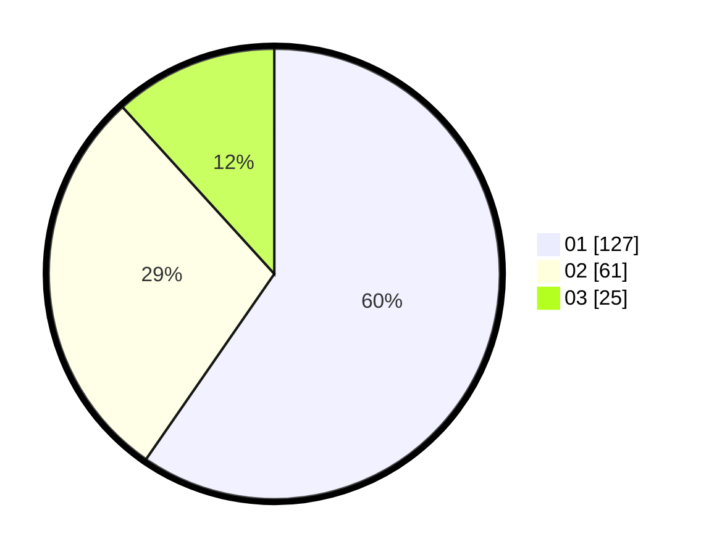

# Hasil

Hasil perolehan suara paslon dapat dilihat pada file paslon-01.txt, paslon-02.txt, dan paslon-03.txt.

Jika tidak ada, artinya data tersebut belum ada pada SIREKAP.

## Perolehan Suara

 * Paslon 01: **127**.
 * Paslon 02: **61**.
 * Paslon 03: **25**.

## Foto C Plano

https://sirekap-obj-formc.kpu.go.id/fcc4/pemilu/ppwp/31/73/08/10/05/3173081005043-20240214-155336--3ded0c5b-28d8-45f9-9eac-f86e2b8362b1.jpg

https://sirekap-obj-formc.kpu.go.id/fcc4/pemilu/ppwp/31/73/08/10/05/3173081005043-20240214-155112--7aa5924e-de9b-488b-bd6b-66f143683c10.jpg

https://sirekap-obj-formc.kpu.go.id/fcc4/pemilu/ppwp/31/73/08/10/05/3173081005043-20240214-155328--c52df3f0-74ce-46fc-bbea-f31f94f5bbf0.jpg

## DATA PEMILIH TETAP

Jumlah pemilih dalam DPT: **288**.
 * L: **136**.
 * P: **152**.

## DATA PENGGUNA HAK PILIH

Jumlah pengguna hak pilih dalam DPT: **214**.
 * L: **103**.
 * P: **111**.

Jumlah pengguna hak pilih dalam DPTb: **1**.
 * L: **1**.
 * P: **0**.

Jumlah pengguna hak pilih dalam DPK: **2**.
 * L: **0**.
 * P: **2**.

Jumlah pengguna hak pilih: **217**.
 * L: **104**.
 * P: **113**.

## JUMLAH SUARA SAH DAN TIDAK SAH

JUMLAH SELURUH SUARA SAH: **213**.

JUMLAH SUARA TIDAK SAH: **4**.

JUMLAH SELURUH SUARA SAH DAN SUARA TIDAK SAH: **217**.
