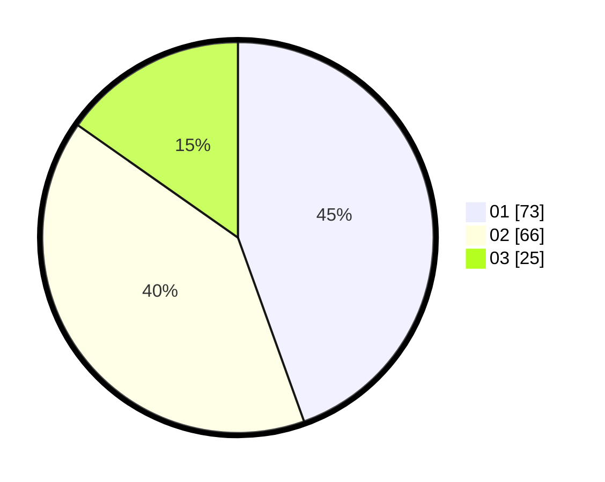

# Hasil

Hasil perolehan suara paslon dapat dilihat pada file paslon-01.txt, paslon-02.txt, dan paslon-03.txt.

Jika tidak ada, artinya data tersebut belum ada pada SIREKAP.

## Perolehan Suara

 * Paslon 01: **73**.
 * Paslon 02: **66**.
 * Paslon 03: **25**.

## Foto C Plano

https://sirekap-obj-formc.kpu.go.id/6035/pemilu/ppwp/31/73/08/10/05/3173081005047-20240214-194459--39ab1d73-9d55-49bd-aec0-8085db2dd2de.jpg

https://sirekap-obj-formc.kpu.go.id/6035/pemilu/ppwp/31/73/08/10/05/3173081005047-20240214-194800--467ce7df-2d18-4c86-bff6-261b4cf3ac36.jpg

https://sirekap-obj-formc.kpu.go.id/6035/pemilu/ppwp/31/73/08/10/05/3173081005047-20240214-195109--d43f9cfa-37ab-4176-8cd8-ac49ae071082.jpg

## DATA PEMILIH TETAP

Jumlah pemilih dalam DPT: **238**.
 * L: **107**.
 * P: **131**.

## DATA PENGGUNA HAK PILIH

Jumlah pengguna hak pilih dalam DPT: **158**.
 * L: **69**.
 * P: **89**.

Jumlah pengguna hak pilih dalam DPTb: **1**.
 * L: **1**.
 * P: **0**.

Jumlah pengguna hak pilih dalam DPK: **7**.
 * L: **5**.
 * P: **2**.

Jumlah pengguna hak pilih: **166**.
 * L: **75**.
 * P: **91**.

## JUMLAH SUARA SAH DAN TIDAK SAH

JUMLAH SELURUH SUARA SAH: **164**.

JUMLAH SUARA TIDAK SAH: **2**.

JUMLAH SELURUH SUARA SAH DAN SUARA TIDAK SAH: **166**.
