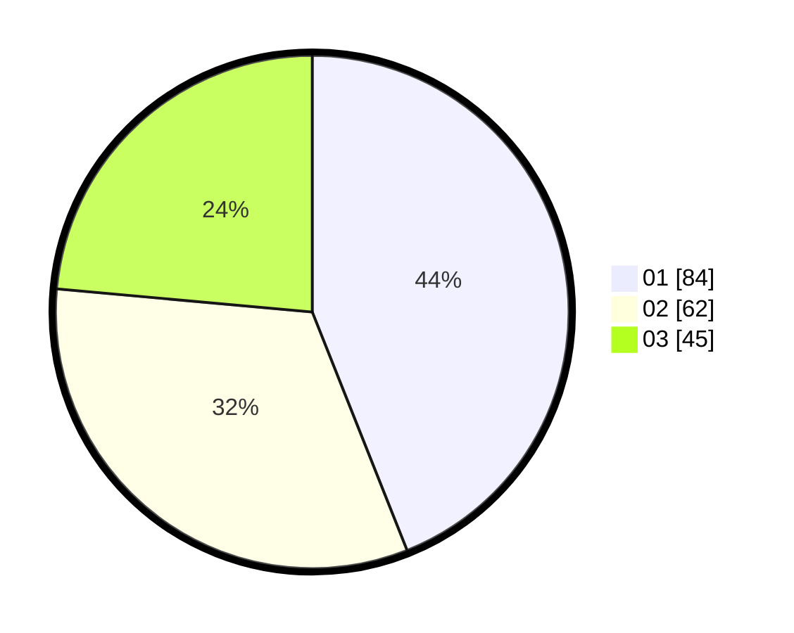

# Hasil

Hasil perolehan suara paslon dapat dilihat pada file paslon-01.txt, paslon-02.txt, dan paslon-03.txt.

Jika tidak ada, artinya data tersebut belum ada pada SIREKAP.

## Perolehan Suara

 * Paslon 01: **84**.
 * Paslon 02: **62**.
 * Paslon 03: **45**.

## Foto C Plano

https://sirekap-obj-formc.kpu.go.id/316e/pemilu/ppwp/31/73/08/10/05/3173081005048-20240214-223808--39e2679f-2d8f-461f-b928-eacb97a0e478.jpg

https://sirekap-obj-formc.kpu.go.id/316e/pemilu/ppwp/31/73/08/10/05/3173081005048-20240214-224103--d2d3c5a1-78ea-4a4f-bfe5-98ee1a7fca76.jpg

https://sirekap-obj-formc.kpu.go.id/316e/pemilu/ppwp/31/73/08/10/05/3173081005048-20240214-223637--f1f6ca51-8fb2-4035-9839-92a625870730.jpg
