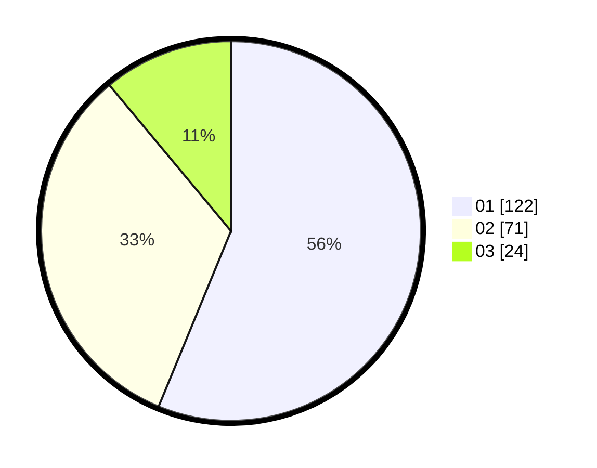

# Hasil

Hasil perolehan suara paslon dapat dilihat pada file paslon-01.txt, paslon-02.txt, dan paslon-03.txt.

Jika tidak ada, artinya data tersebut belum ada pada SIREKAP.

## Perolehan Suara

 * Paslon 01: **122**.
 * Paslon 02: **71**.
 * Paslon 03: **24**.

## Foto C Plano

https://sirekap-obj-formc.kpu.go.id/82e8/pemilu/ppwp/31/73/08/10/05/3173081005051-20240214-204245--82f94c48-b149-446d-b745-b4f526ca2df2.jpg

https://sirekap-obj-formc.kpu.go.id/82e8/pemilu/ppwp/31/73/08/10/05/3173081005051-20240214-204036--c039179c-a378-4a3e-9289-6125d6fc717f.jpg

https://sirekap-obj-formc.kpu.go.id/82e8/pemilu/ppwp/31/73/08/10/05/3173081005051-20240214-214929--2c8a688c-7bb9-4652-83f7-5c7dc4bd3811.jpg

## DATA PEMILIH TETAP

Jumlah pemilih dalam DPT: **280**.
 * L: **147**.
 * P: **133**.

## DATA PENGGUNA HAK PILIH

Jumlah pengguna hak pilih dalam DPT: **215**.
 * L: **110**.
 * P: **105**.

Jumlah pengguna hak pilih dalam DPTb: **2**.
 * L: **1**.
 * P: **1**.

Jumlah pengguna hak pilih dalam DPK: **3**.
 * L: **1**.
 * P: **2**.

Jumlah pengguna hak pilih: **220**.
 * L: **112**.
 * P: **108**.

## JUMLAH SUARA SAH DAN TIDAK SAH

JUMLAH SELURUH SUARA SAH: **227**.

JUMLAH SUARA TIDAK SAH: **553**.

JUMLAH SELURUH SUARA SAH DAN SUARA TIDAK SAH: **220**.
