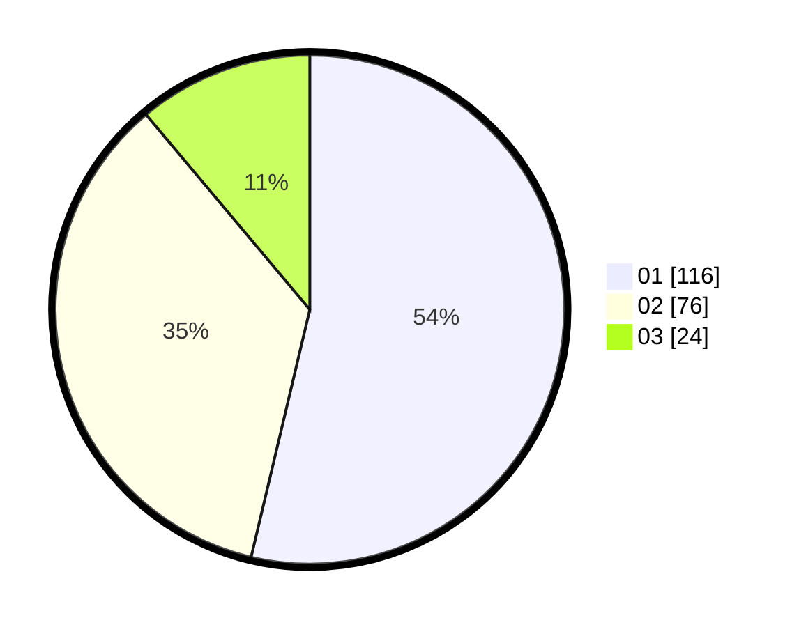

# Hasil

Hasil perolehan suara paslon dapat dilihat pada file paslon-01.txt, paslon-02.txt, dan paslon-03.txt.

Jika tidak ada, artinya data tersebut belum ada pada SIREKAP.

## Perolehan Suara

 * Paslon 01: **116**.
 * Paslon 02: **76**.
 * Paslon 03: **24**.

## Foto C Plano

https://sirekap-obj-formc.kpu.go.id/7c37/pemilu/ppwp/31/73/08/10/05/3173081005052-20240214-225547--1254d562-e5ee-4d60-b216-34c73bd7fb6e.jpg

https://sirekap-obj-formc.kpu.go.id/7c37/pemilu/ppwp/31/73/08/10/05/3173081005052-20240214-224853--e47ad59e-59bf-4f87-88f0-573e31dff5ba.jpg

https://sirekap-obj-formc.kpu.go.id/7c37/pemilu/ppwp/31/73/08/10/05/3173081005052-20240214-225049--9cf6d3da-66e4-43a9-b21e-14b4e72714d0.jpg
