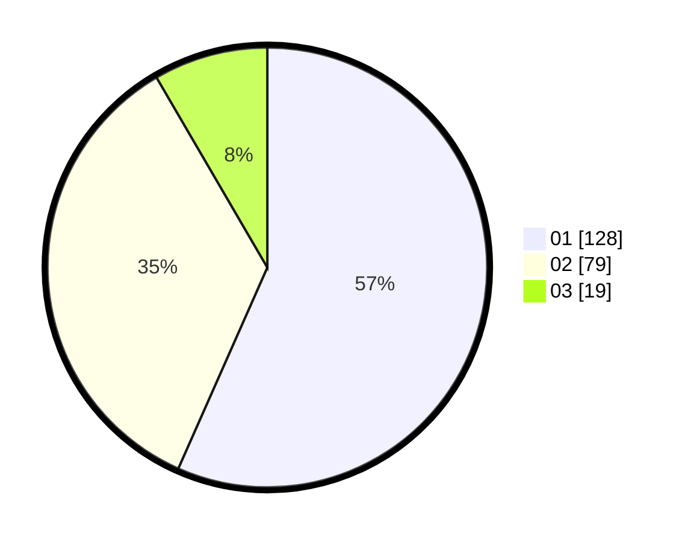

# Hasil

Hasil perolehan suara paslon dapat dilihat pada file paslon-01.txt, paslon-02.txt, dan paslon-03.txt.

Jika tidak ada, artinya data tersebut belum ada pada SIREKAP.

## Perolehan Suara

 * Paslon 01: **128**.
 * Paslon 02: **79**.
 * Paslon 03: **19**.

## Foto C Plano

https://sirekap-obj-formc.kpu.go.id/4503/pemilu/ppwp/31/73/08/10/05/3173081005053-20240214-184505--ca43f08d-8585-44ea-9d0a-0cfb6366ede8.jpg

https://sirekap-obj-formc.kpu.go.id/4503/pemilu/ppwp/31/73/08/10/05/3173081005053-20240214-184721--4b0bd608-3fb4-40a6-93c5-23cb7f111f72.jpg

https://sirekap-obj-formc.kpu.go.id/4503/pemilu/ppwp/31/73/08/10/05/3173081005053-20240214-184823--03b365ce-91f2-4c81-9757-49b0597c8f11.jpg

## DATA PEMILIH TETAP

Jumlah pemilih dalam DPT: **268**.
 * L: **135**.
 * P: **133**.

## DATA PENGGUNA HAK PILIH

Jumlah pengguna hak pilih dalam DPT: **217**.
 * L: **105**.
 * P: **112**.

Jumlah pengguna hak pilih dalam DPTb: **2**.
 * L: **0**.
 * P: **2**.

Jumlah pengguna hak pilih dalam DPK: **10**.
 * L: **5**.
 * P: **5**.

Jumlah pengguna hak pilih: **229**.
 * L: **110**.
 * P: **119**.

## JUMLAH SUARA SAH DAN TIDAK SAH

JUMLAH SELURUH SUARA SAH: **226**.

JUMLAH SUARA TIDAK SAH: **3**.

JUMLAH SELURUH SUARA SAH DAN SUARA TIDAK SAH: **229**.
