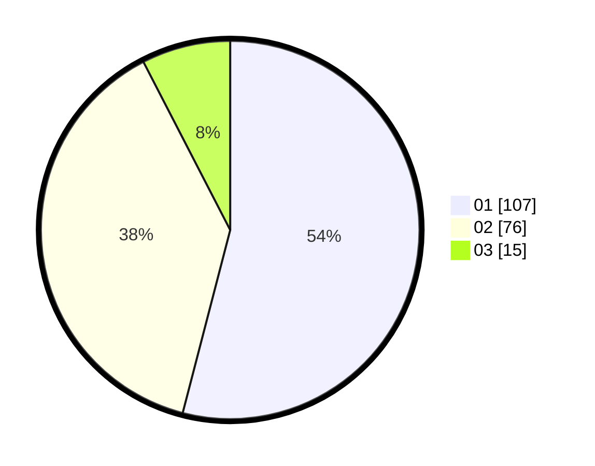

# Hasil

Hasil perolehan suara paslon dapat dilihat pada file paslon-01.txt, paslon-02.txt, dan paslon-03.txt.

Jika tidak ada, artinya data tersebut belum ada pada SIREKAP.

## Perolehan Suara

 * Paslon 01: **107**.
 * Paslon 02: **76**.
 * Paslon 03: **15**.

## Foto C Plano

https://sirekap-obj-formc.kpu.go.id/a2c6/pemilu/ppwp/31/73/08/10/05/3173081005054-20240214-230019--67e9e611-7a2a-4791-956e-c7f52e7ffb39.jpg

https://sirekap-obj-formc.kpu.go.id/a2c6/pemilu/ppwp/31/73/08/10/05/3173081005054-20240214-230058--c1434283-78c1-457e-b96a-077a360632dc.jpg

https://sirekap-obj-formc.kpu.go.id/a2c6/pemilu/ppwp/31/73/08/10/05/3173081005054-20240214-230149--aff29385-a7a2-4e1d-bc82-c22f545eea42.jpg
