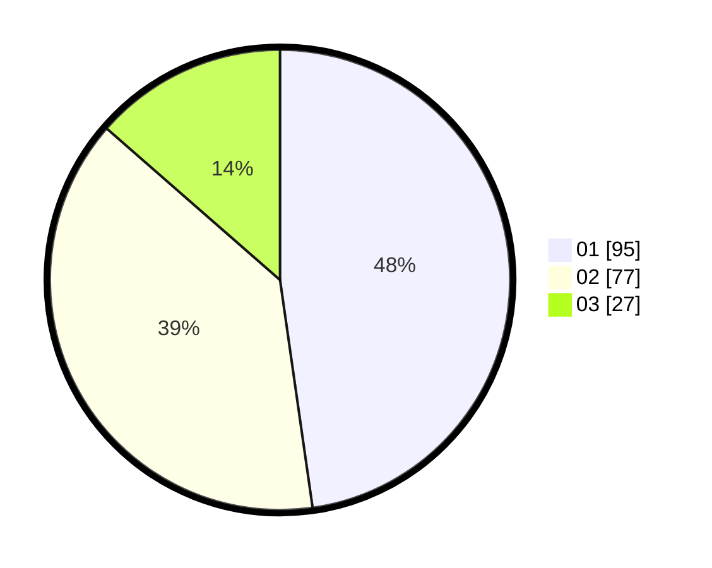

# Hasil

Hasil perolehan suara paslon dapat dilihat pada file paslon-01.txt, paslon-02.txt, dan paslon-03.txt.

Jika tidak ada, artinya data tersebut belum ada pada SIREKAP.

## Perolehan Suara

 * Paslon 01: **95**.
 * Paslon 02: **77**.
 * Paslon 03: **27**.

## Foto C Plano

https://sirekap-obj-formc.kpu.go.id/3df6/pemilu/ppwp/31/73/08/10/05/3173081005055-20240216-035036--9d26010e-b97a-4489-b550-0d668b191aad.jpg

https://sirekap-obj-formc.kpu.go.id/3df6/pemilu/ppwp/31/73/08/10/05/3173081005055-20240216-035043--08a9c46f-2727-46d7-b05a-343d6e8825aa.jpg

https://sirekap-obj-formc.kpu.go.id/3df6/pemilu/ppwp/31/73/08/10/05/3173081005055-20240216-034939--83fa500e-9658-4742-82ec-eb84036ad22e.jpg

## DATA PEMILIH TETAP

Jumlah pemilih dalam DPT: **237**.
 * L: **112**.
 * P: **125**.

## DATA PENGGUNA HAK PILIH

Jumlah pengguna hak pilih dalam DPT: **201**.
 * L: **91**.
 * P: **110**.

Jumlah pengguna hak pilih dalam DPTb: **1**.
 * L: **0**.
 * P: **1**.

Jumlah pengguna hak pilih dalam DPK: **0**.
 * L: **0**.
 * P: **0**.

Jumlah pengguna hak pilih: **202**.
 * L: **91**.
 * P: **111**.

## JUMLAH SUARA SAH DAN TIDAK SAH

JUMLAH SELURUH SUARA SAH: **199**.

JUMLAH SUARA TIDAK SAH: **3**.

JUMLAH SELURUH SUARA SAH DAN SUARA TIDAK SAH: **202**.
