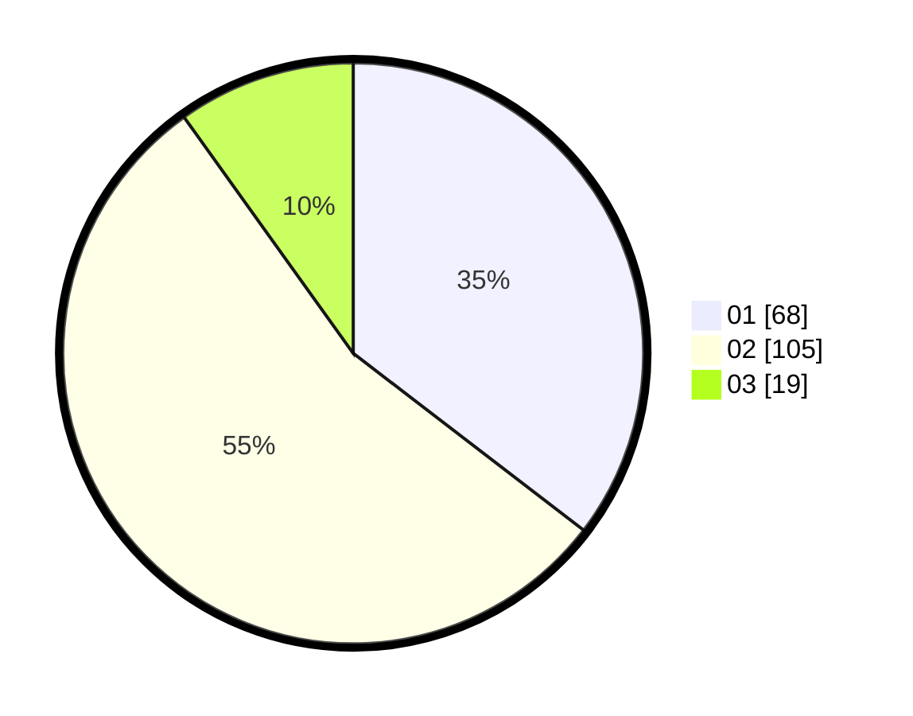

# Hasil

Hasil perolehan suara paslon dapat dilihat pada file paslon-01.txt, paslon-02.txt, dan paslon-03.txt.

Jika tidak ada, artinya data tersebut belum ada pada SIREKAP.

## Perolehan Suara

 * Paslon 01: **68**.
 * Paslon 02: **105**.
 * Paslon 03: **19**.

## Foto C Plano

https://sirekap-obj-formc.kpu.go.id/9b27/pemilu/ppwp/31/73/08/10/05/3173081005056-20240214-155217--4e339e60-5c0e-49bb-81df-cc51445dac9b.jpg

https://sirekap-obj-formc.kpu.go.id/9b27/pemilu/ppwp/31/73/08/10/05/3173081005056-20240214-155127--6add895b-734d-4419-adbb-4ecab439e79f.jpg

https://sirekap-obj-formc.kpu.go.id/9b27/pemilu/ppwp/31/73/08/10/05/3173081005056-20240214-192653--c7f5aaeb-dd98-431e-acb0-dfc8a44f28af.jpg

## DATA PEMILIH TETAP

Jumlah pemilih dalam DPT: **189**.
 * L: **96**.
 * P: **93**.

## DATA PENGGUNA HAK PILIH

Jumlah pengguna hak pilih dalam DPT: **189**.
 * L: **96**.
 * P: **93**.

Jumlah pengguna hak pilih dalam DPTb: **3**.
 * L: **2**.
 * P: **1**.

Jumlah pengguna hak pilih dalam DPK: **2**.
 * L: **1**.
 * P: **1**.

Jumlah pengguna hak pilih: **194**.
 * L: **99**.
 * P: **95**.

## JUMLAH SUARA SAH DAN TIDAK SAH

JUMLAH SELURUH SUARA SAH: **192**.

JUMLAH SUARA TIDAK SAH: **2**.

JUMLAH SELURUH SUARA SAH DAN SUARA TIDAK SAH: **194**.
