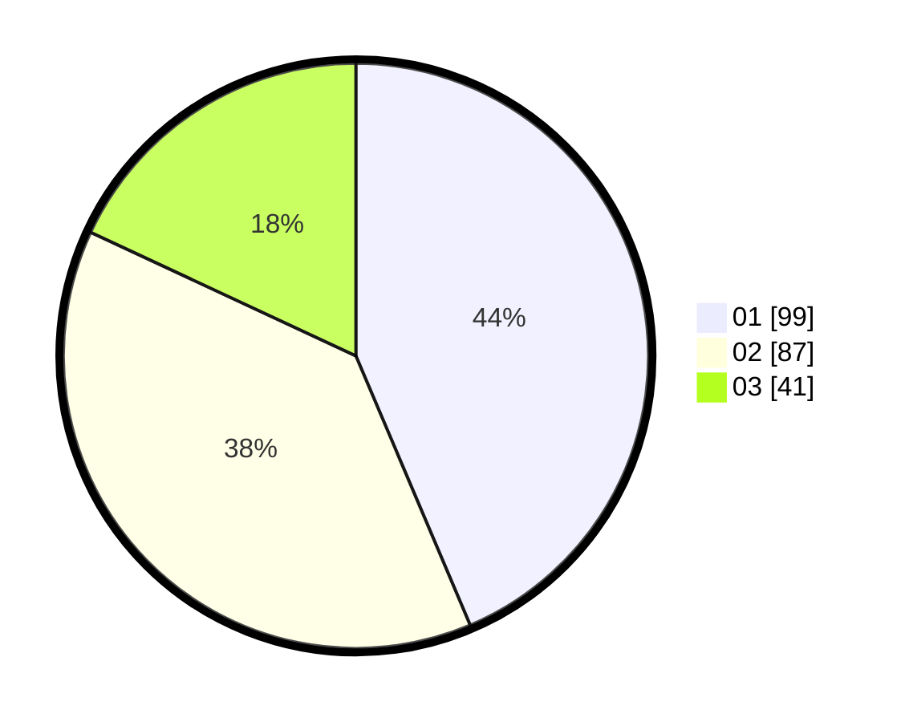

# Hasil

Hasil perolehan suara paslon dapat dilihat pada file paslon-01.txt, paslon-02.txt, dan paslon-03.txt.

Jika tidak ada, artinya data tersebut belum ada pada SIREKAP.

## Perolehan Suara

 * Paslon 01: **99**.
 * Paslon 02: **87**.
 * Paslon 03: **41**.

## Foto C Plano

https://sirekap-obj-formc.kpu.go.id/1e0f/pemilu/ppwp/31/73/08/10/05/3173081005058-20240214-222307--bde5c271-956c-4aaa-9f6c-1415061ad9eb.jpg

https://sirekap-obj-formc.kpu.go.id/1e0f/pemilu/ppwp/31/73/08/10/05/3173081005058-20240214-222312--0bfeed2c-0268-4ac4-b64d-d6c63b522ae6.jpg

https://sirekap-obj-formc.kpu.go.id/1e0f/pemilu/ppwp/31/73/08/10/05/3173081005058-20240214-222945--bd50ba53-5920-43cd-9f63-165f5ca10f12.jpg
