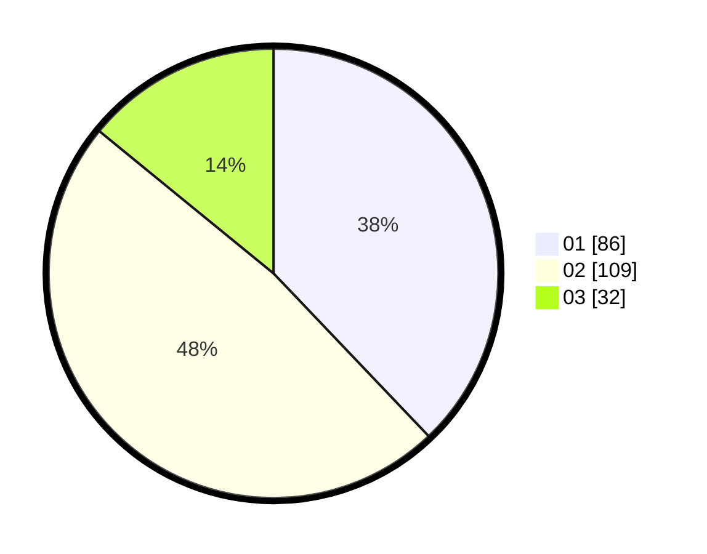

# Hasil

Hasil perolehan suara paslon dapat dilihat pada file paslon-01.txt, paslon-02.txt, dan paslon-03.txt.

Jika tidak ada, artinya data tersebut belum ada pada SIREKAP.

## Perolehan Suara

 * Paslon 01: **86**.
 * Paslon 02: **109**.
 * Paslon 03: **32**.

## Foto C Plano

https://sirekap-obj-formc.kpu.go.id/8036/pemilu/ppwp/31/73/08/10/05/3173081005067-20240214-224723--39192dab-cfd6-4879-bd28-58ac4e9b407c.jpg

https://sirekap-obj-formc.kpu.go.id/8036/pemilu/ppwp/31/73/08/10/05/3173081005067-20240214-224824--7a9d408a-9920-48ef-9bde-39b7a835c350.jpg
