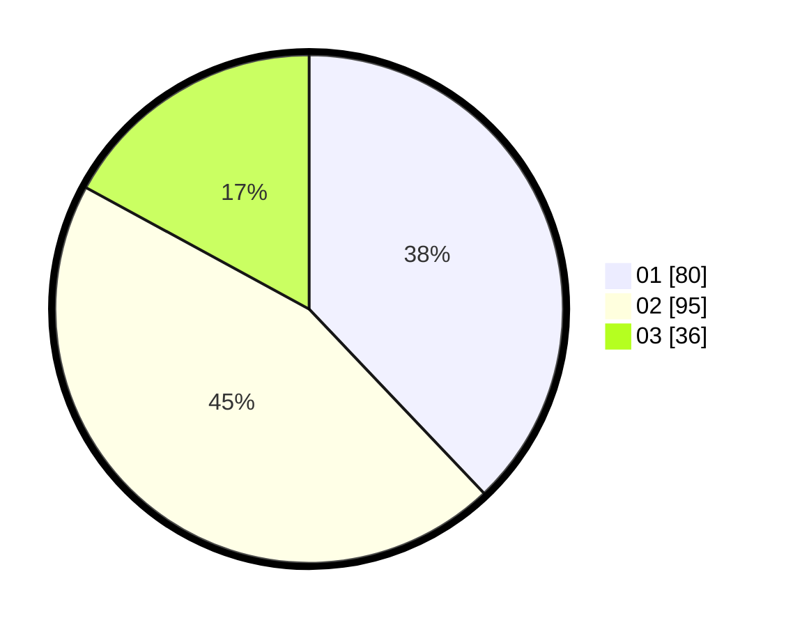

# Hasil

Hasil perolehan suara paslon dapat dilihat pada file paslon-01.txt, paslon-02.txt, dan paslon-03.txt.

Jika tidak ada, artinya data tersebut belum ada pada SIREKAP.

## Perolehan Suara

 * Paslon 01: **80**.
 * Paslon 02: **95**.
 * Paslon 03: **36**.

## Foto C Plano

https://sirekap-obj-formc.kpu.go.id/0b50/pemilu/ppwp/31/73/08/10/05/3173081005069-20240214-223336--5fef6fbb-0784-47d4-a7db-527c229a829f.jpg

https://sirekap-obj-formc.kpu.go.id/0b50/pemilu/ppwp/31/73/08/10/05/3173081005069-20240214-223427--e11c08ca-533b-486f-b019-e15c91274ba4.jpg

https://sirekap-obj-formc.kpu.go.id/0b50/pemilu/ppwp/31/73/08/10/05/3173081005069-20240214-223521--2f9e88f8-1de5-4131-8f38-1a1605e692ee.jpg
