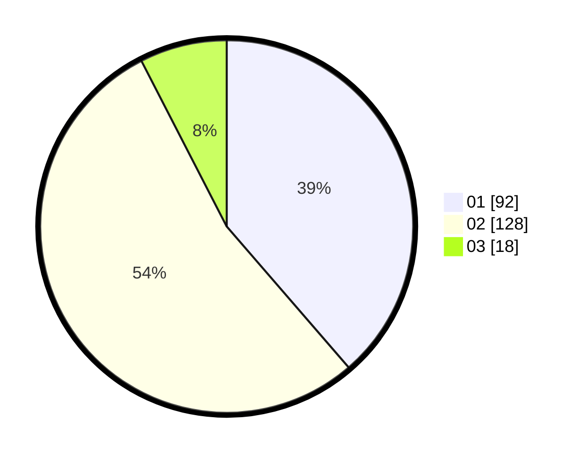

# Hasil

Hasil perolehan suara paslon dapat dilihat pada file paslon-01.txt, paslon-02.txt, dan paslon-03.txt.

Jika tidak ada, artinya data tersebut belum ada pada SIREKAP.

## Perolehan Suara

 * Paslon 01: **92**.
 * Paslon 02: **128**.
 * Paslon 03: **18**.

## Foto C Plano

https://sirekap-obj-formc.kpu.go.id/c839/pemilu/ppwp/31/73/08/10/05/3173081005073-20240216-012746--e77f9220-6a0e-4d39-8120-6ef85aca9e33.jpg

https://sirekap-obj-formc.kpu.go.id/c839/pemilu/ppwp/31/73/08/10/05/3173081005073-20240216-012755--71410779-9c2c-4936-9fa9-65ce70dd993f.jpg

https://sirekap-obj-formc.kpu.go.id/c839/pemilu/ppwp/31/73/08/10/05/3173081005073-20240216-012749--5afee495-f7a7-4f45-b6f7-540016c28f96.jpg

## DATA PEMILIH TETAP

Jumlah pemilih dalam DPT: **278**.
 * L: **138**.
 * P: **140**.

## DATA PENGGUNA HAK PILIH

Jumlah pengguna hak pilih dalam DPT: **236**.
 * L: **116**.
 * P: **120**.

Jumlah pengguna hak pilih dalam DPTb: **2**.
 * L: **2**.
 * P: **0**.

Jumlah pengguna hak pilih dalam DPK: **1**.
 * L: **1**.
 * P: **0**.

Jumlah pengguna hak pilih: **239**.
 * L: **119**.
 * P: **120**.

## JUMLAH SUARA SAH DAN TIDAK SAH

JUMLAH SELURUH SUARA SAH: **238**.

JUMLAH SUARA TIDAK SAH: **1**.

JUMLAH SELURUH SUARA SAH DAN SUARA TIDAK SAH: **239**.
