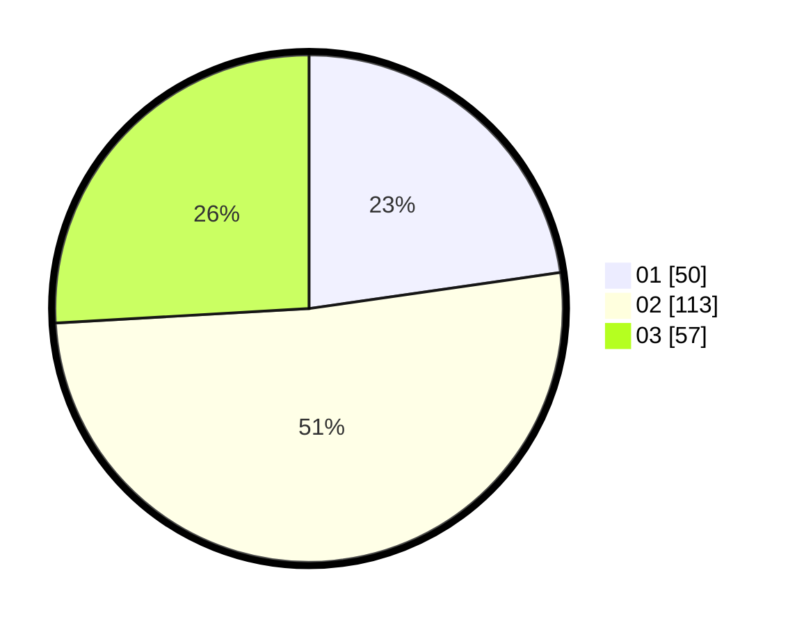

# Hasil

Hasil perolehan suara paslon dapat dilihat pada file paslon-01.txt, paslon-02.txt, dan paslon-03.txt.

Jika tidak ada, artinya data tersebut belum ada pada SIREKAP.

## Perolehan Suara

 * Paslon 01: **50**.
 * Paslon 02: **113**.
 * Paslon 03: **57**.

## Foto C Plano

https://sirekap-obj-formc.kpu.go.id/8882/pemilu/ppwp/31/73/08/10/05/3173081005076-20240214-224352--bc61912a-2399-4d99-a1ca-5d4120ded7d8.jpg

https://sirekap-obj-formc.kpu.go.id/8882/pemilu/ppwp/31/73/08/10/05/3173081005076-20240214-224126--1162116c-7ae2-4db3-9dbb-e33462802617.jpg

https://sirekap-obj-formc.kpu.go.id/8882/pemilu/ppwp/31/73/08/10/05/3173081005076-20240214-224249--c6579b46-1965-4936-b69a-0924cf9d2ba9.jpg
