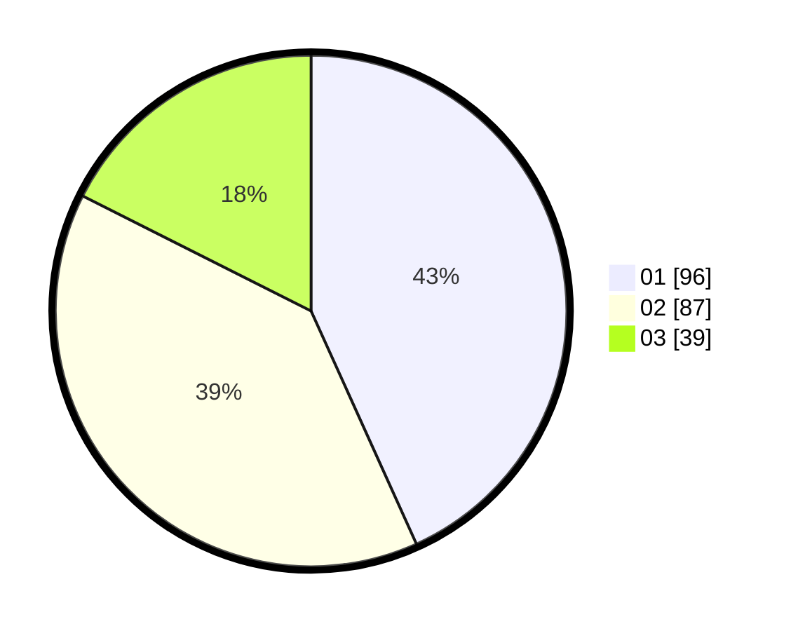

# Hasil

Hasil perolehan suara paslon dapat dilihat pada file paslon-01.txt, paslon-02.txt, dan paslon-03.txt.

Jika tidak ada, artinya data tersebut belum ada pada SIREKAP.

## Perolehan Suara

 * Paslon 01: **96**.
 * Paslon 02: **87**.
 * Paslon 03: **39**.

## Foto C Plano

https://sirekap-obj-formc.kpu.go.id/bc49/pemilu/ppwp/31/73/08/10/05/3173081005078-20240214-231332--c3e21977-8f8a-4f69-b427-34f492918cbf.jpg

https://sirekap-obj-formc.kpu.go.id/bc49/pemilu/ppwp/31/73/08/10/05/3173081005078-20240214-231432--497dc26b-f954-47bf-98ed-14efc768819e.jpg

https://sirekap-obj-formc.kpu.go.id/bc49/pemilu/ppwp/31/73/08/10/05/3173081005078-20240214-231531--cad15624-3ec6-4287-a60d-808ff786dffc.jpg

## DATA PEMILIH TETAP

Jumlah pemilih dalam DPT: **277**.
 * L: **136**.
 * P: **141**.

## DATA PENGGUNA HAK PILIH

Jumlah pengguna hak pilih dalam DPT: **224**.
 * L: **108**.
 * P: **116**.

Jumlah pengguna hak pilih dalam DPTb: **0**.
 * L: **0**.
 * P: **0**.

Jumlah pengguna hak pilih dalam DPK: **1**.
 * L: **0**.
 * P: **1**.

Jumlah pengguna hak pilih: **225**.
 * L: **108**.
 * P: **117**.

## JUMLAH SUARA SAH DAN TIDAK SAH

JUMLAH SELURUH SUARA SAH: **222**.

JUMLAH SUARA TIDAK SAH: **3**.

JUMLAH SELURUH SUARA SAH DAN SUARA TIDAK SAH: **225**.
