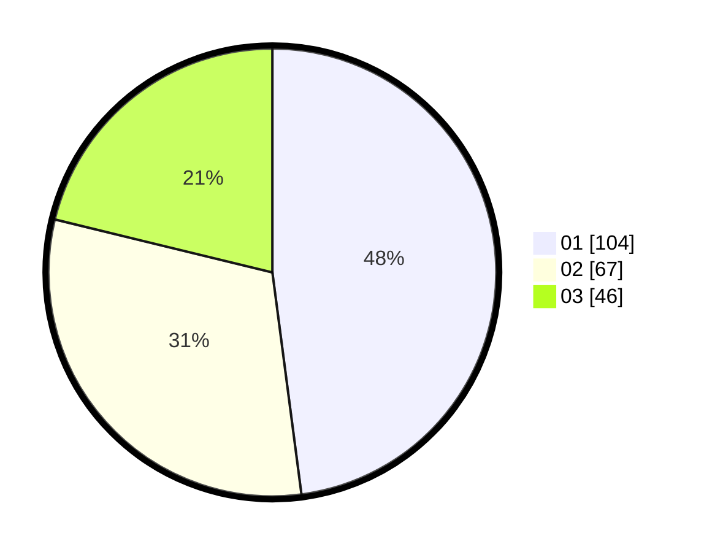

# Hasil

Hasil perolehan suara paslon dapat dilihat pada file paslon-01.txt, paslon-02.txt, dan paslon-03.txt.

Jika tidak ada, artinya data tersebut belum ada pada SIREKAP.

## Perolehan Suara

 * Paslon 01: **104**.
 * Paslon 02: **67**.
 * Paslon 03: **46**.

## Foto C Plano

https://sirekap-obj-formc.kpu.go.id/97e0/pemilu/ppwp/31/73/08/10/05/3173081005079-20240214-190225--eec24612-d083-441d-97c2-3369c729fab7.jpg

https://sirekap-obj-formc.kpu.go.id/97e0/pemilu/ppwp/31/73/08/10/05/3173081005079-20240214-190237--57f9ef75-a0dd-497a-9e12-249db4d256cb.jpg

https://sirekap-obj-formc.kpu.go.id/97e0/pemilu/ppwp/31/73/08/10/05/3173081005079-20240214-190248--c9b8f6fc-cb87-4094-9f74-3b498c2adc6d.jpg

## DATA PEMILIH TETAP

Jumlah pemilih dalam DPT: **263**.
 * L: **122**.
 * P: **141**.

## DATA PENGGUNA HAK PILIH

Jumlah pengguna hak pilih dalam DPT: **208**.
 * L: **96**.
 * P: **112**.

Jumlah pengguna hak pilih dalam DPTb: **7**.
 * L: **3**.
 * P: **4**.

Jumlah pengguna hak pilih dalam DPK: **2**.
 * L: **0**.
 * P: **2**.

Jumlah pengguna hak pilih: **217**.
 * L: **99**.
 * P: **118**.

## JUMLAH SUARA SAH DAN TIDAK SAH

JUMLAH SELURUH SUARA SAH: **217**.

JUMLAH SUARA TIDAK SAH: **0**.

JUMLAH SELURUH SUARA SAH DAN SUARA TIDAK SAH: **217**.
