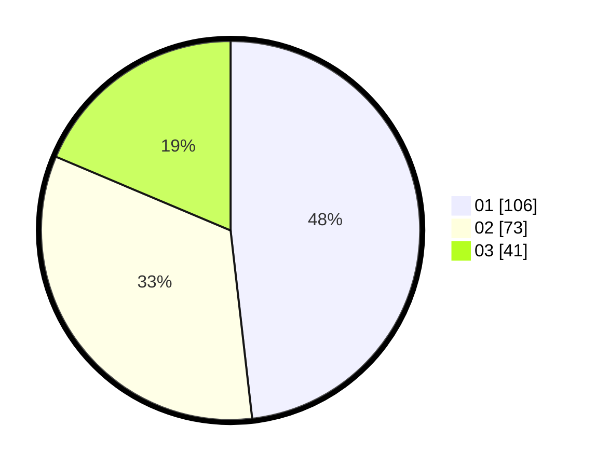

# Hasil

Hasil perolehan suara paslon dapat dilihat pada file paslon-01.txt, paslon-02.txt, dan paslon-03.txt.

Jika tidak ada, artinya data tersebut belum ada pada SIREKAP.

## Perolehan Suara

 * Paslon 01: **106**.
 * Paslon 02: **73**.
 * Paslon 03: **41**.

## Foto C Plano

https://sirekap-obj-formc.kpu.go.id/7108/pemilu/ppwp/31/73/08/10/05/3173081005080-20240214-205840--2990e6f3-f5d8-4db5-ba48-06c93720dd8b.jpg

https://sirekap-obj-formc.kpu.go.id/7108/pemilu/ppwp/31/73/08/10/05/3173081005080-20240214-201154--a258ddd0-2d05-471e-857c-d2755fddf2bb.jpg

https://sirekap-obj-formc.kpu.go.id/7108/pemilu/ppwp/31/73/08/10/05/3173081005080-20240214-202249--c5328d43-4890-4456-992c-265d58bb36c5.jpg
