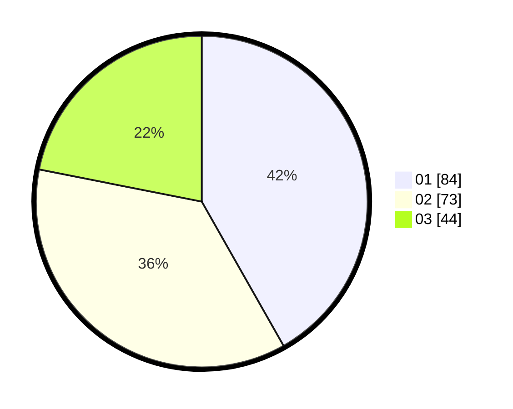

# Hasil

Hasil perolehan suara paslon dapat dilihat pada file paslon-01.txt, paslon-02.txt, dan paslon-03.txt.

Jika tidak ada, artinya data tersebut belum ada pada SIREKAP.

## Perolehan Suara

 * Paslon 01: **84**.
 * Paslon 02: **73**.
 * Paslon 03: **44**.

## Foto C Plano

https://sirekap-obj-formc.kpu.go.id/efa4/pemilu/ppwp/31/73/08/10/05/3173081005086-20240214-175309--d5965968-3ab0-4215-9ee5-181a9b84b620.jpg

https://sirekap-obj-formc.kpu.go.id/efa4/pemilu/ppwp/31/73/08/10/05/3173081005086-20240214-232344--d4d7fff2-21cd-496b-84e3-fccb3b346759.jpg

https://sirekap-obj-formc.kpu.go.id/efa4/pemilu/ppwp/31/73/08/10/05/3173081005086-20240214-175316--e353eaf4-466d-4945-9fe1-fc9b7686eb6b.jpg
