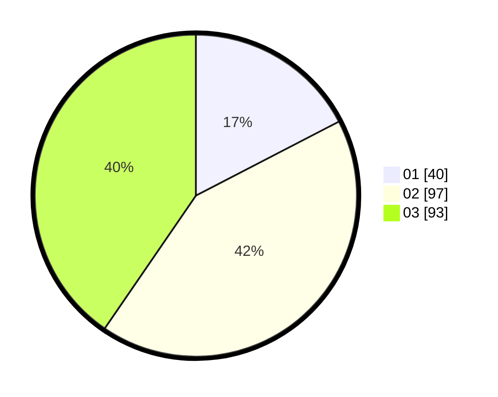

# Hasil

Hasil perolehan suara paslon dapat dilihat pada file paslon-01.txt, paslon-02.txt, dan paslon-03.txt.

Jika tidak ada, artinya data tersebut belum ada pada SIREKAP.

## Perolehan Suara

 * Paslon 01: **40**.
 * Paslon 02: **97**.
 * Paslon 03: **93**.

## Foto C Plano

https://sirekap-obj-formc.kpu.go.id/9b1f/pemilu/ppwp/31/73/08/10/05/3173081005088-20240214-191706--42eb9c50-5901-4962-b6eb-bf98156dedd0.jpg

https://sirekap-obj-formc.kpu.go.id/9b1f/pemilu/ppwp/31/73/08/10/05/3173081005088-20240214-191932--45a88f38-6a42-41e9-81ea-f9a18a8763b7.jpg

https://sirekap-obj-formc.kpu.go.id/9b1f/pemilu/ppwp/31/73/08/10/05/3173081005088-20240214-192040--26cc5710-8cde-422d-8d33-a06d2feaf256.jpg

## DATA PEMILIH TETAP

Jumlah pemilih dalam DPT: **290**.
 * L: **134**.
 * P: **156**.

## DATA PENGGUNA HAK PILIH

Jumlah pengguna hak pilih dalam DPT: **220**.
 * L: **96**.
 * P: **124**.

Jumlah pengguna hak pilih dalam DPTb: **11**.
 * L: **5**.
 * P: **6**.

Jumlah pengguna hak pilih dalam DPK: **1**.
 * L: **0**.
 * P: **1**.

Jumlah pengguna hak pilih: **232**.
 * L: **101**.
 * P: **131**.

## JUMLAH SUARA SAH DAN TIDAK SAH

JUMLAH SELURUH SUARA SAH: **230**.

JUMLAH SUARA TIDAK SAH: **2**.

JUMLAH SELURUH SUARA SAH DAN SUARA TIDAK SAH: **232**.
