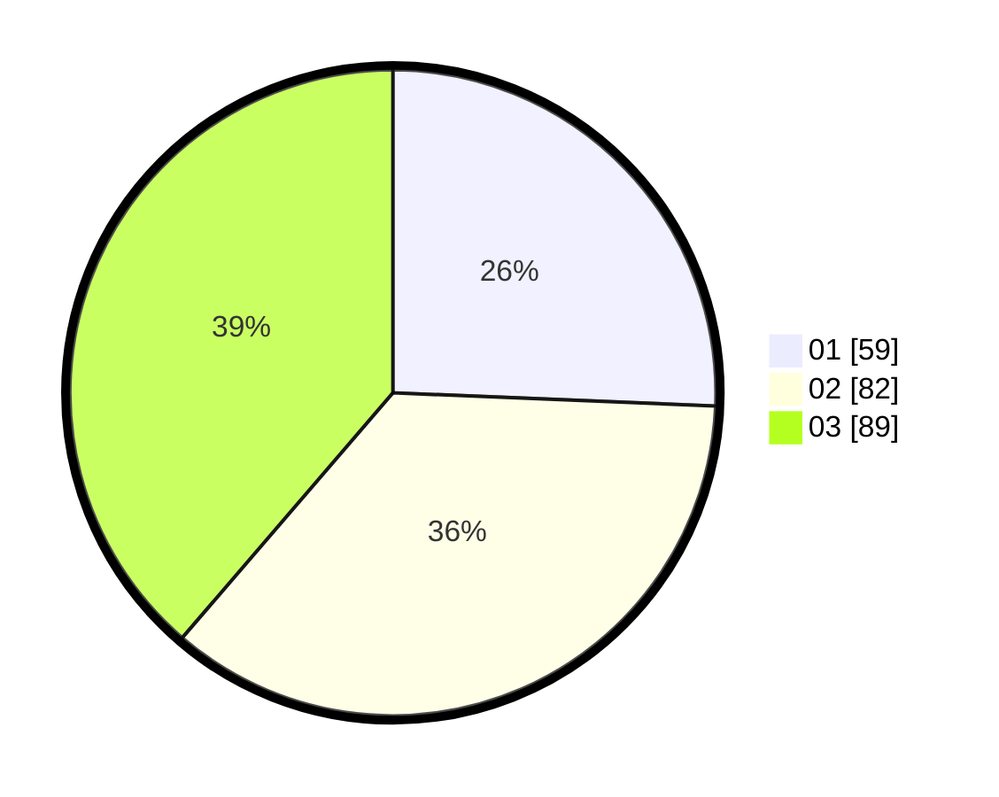

# Hasil

Hasil perolehan suara paslon dapat dilihat pada file paslon-01.txt, paslon-02.txt, dan paslon-03.txt.

Jika tidak ada, artinya data tersebut belum ada pada SIREKAP.

## Perolehan Suara

 * Paslon 01: **59**.
 * Paslon 02: **82**.
 * Paslon 03: **89**.

## Foto C Plano

https://sirekap-obj-formc.kpu.go.id/901e/pemilu/ppwp/31/73/08/10/05/3173081005091-20240214-211343--b8a35b59-f871-4e12-a8c3-ad1b33cd7a1a.jpg

https://sirekap-obj-formc.kpu.go.id/901e/pemilu/ppwp/31/73/08/10/05/3173081005091-20240214-211348--914a0a81-cf38-44bf-9e30-2e963edcb6c6.jpg

https://sirekap-obj-formc.kpu.go.id/901e/pemilu/ppwp/31/73/08/10/05/3173081005091-20240214-211354--68faf1cc-96ac-462c-af80-a9befdc0d92f.jpg
