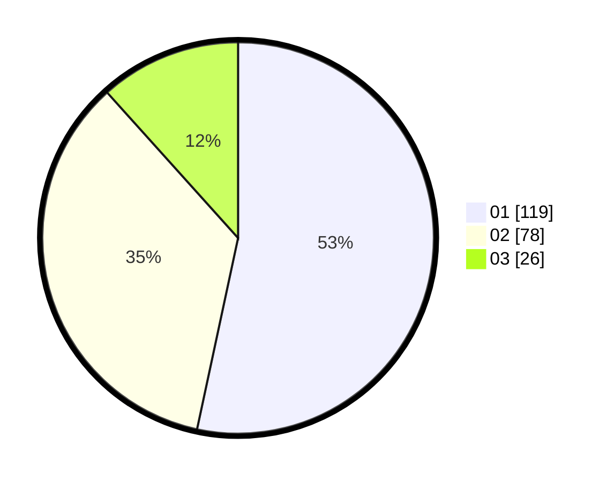

# Hasil

Hasil perolehan suara paslon dapat dilihat pada file paslon-01.txt, paslon-02.txt, dan paslon-03.txt.

Jika tidak ada, artinya data tersebut belum ada pada SIREKAP.

## Perolehan Suara

 * Paslon 01: **119**.
 * Paslon 02: **78**.
 * Paslon 03: **26**.

## Foto C Plano

https://sirekap-obj-formc.kpu.go.id/0e1a/pemilu/ppwp/31/73/08/10/05/3173081005094-20240214-220254--d23783f6-3f03-4661-9853-d89e7971922d.jpg

https://sirekap-obj-formc.kpu.go.id/0e1a/pemilu/ppwp/31/73/08/10/05/3173081005094-20240214-220257--98cb492d-8c1d-402b-9a90-ee86f38c1087.jpg

https://sirekap-obj-formc.kpu.go.id/0e1a/pemilu/ppwp/31/73/08/10/05/3173081005094-20240214-220301--aaa0b728-404f-431e-9da3-2b301a93c46a.jpg
