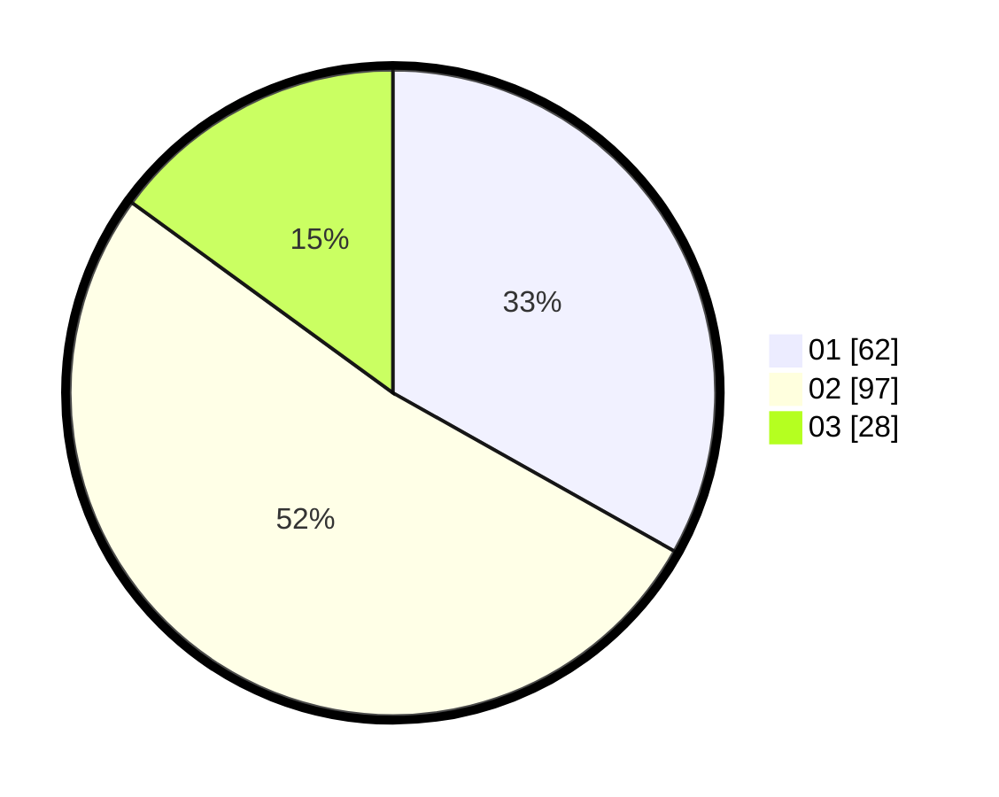

# Hasil

Hasil perolehan suara paslon dapat dilihat pada file paslon-01.txt, paslon-02.txt, dan paslon-03.txt.

Jika tidak ada, artinya data tersebut belum ada pada SIREKAP.

## Perolehan Suara

 * Paslon 01: **62**.
 * Paslon 02: **97**.
 * Paslon 03: **28**.

## Foto C Plano

https://sirekap-obj-formc.kpu.go.id/590d/pemilu/ppwp/31/73/08/10/05/3173081005099-20240214-155140--849ce831-7dab-4a3f-b80c-83ee6303948b.jpg

https://sirekap-obj-formc.kpu.go.id/590d/pemilu/ppwp/31/73/08/10/05/3173081005099-20240214-155308--81f85492-9f14-40b9-b970-97f5b045d2b8.jpg
