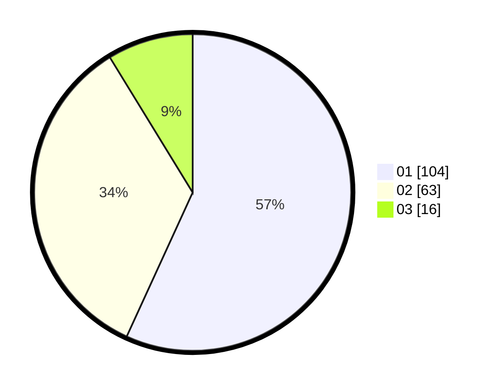

# Hasil

Hasil perolehan suara paslon dapat dilihat pada file paslon-01.txt, paslon-02.txt, dan paslon-03.txt.

Jika tidak ada, artinya data tersebut belum ada pada SIREKAP.

## Perolehan Suara

 * Paslon 01: **104**.
 * Paslon 02: **63**.
 * Paslon 03: **16**.

## Foto C Plano

https://sirekap-obj-formc.kpu.go.id/1b4d/pemilu/ppwp/31/73/08/10/05/3173081005102-20240214-211914--ed392093-afd4-478d-bb1e-1883c44c7e27.jpg

https://sirekap-obj-formc.kpu.go.id/1b4d/pemilu/ppwp/31/73/08/10/05/3173081005102-20240214-222742--c2113c4f-879c-4f8f-9581-0499a49b8952.jpg
