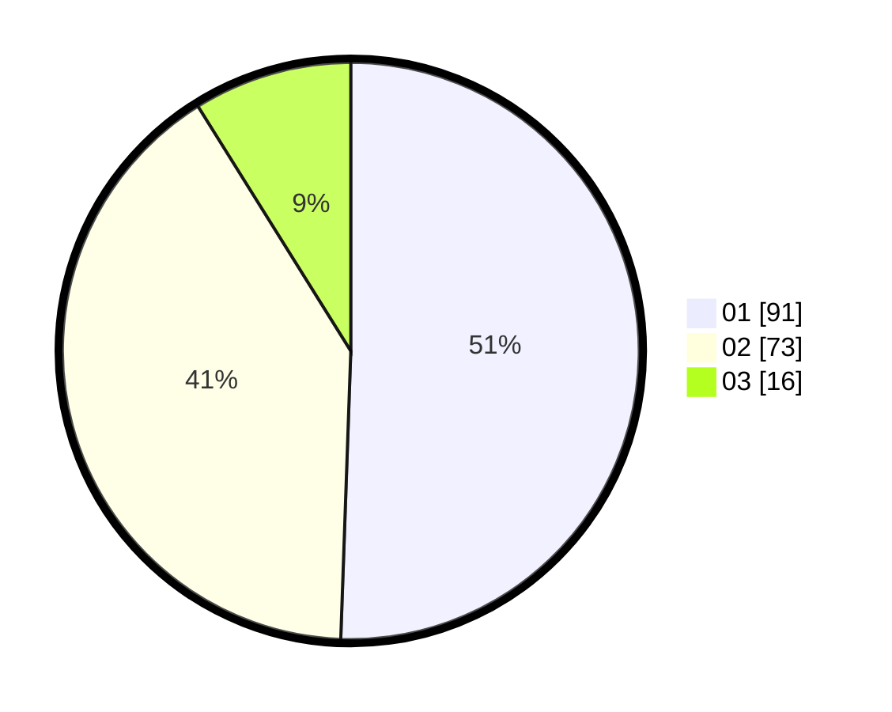

# Hasil

Hasil perolehan suara paslon dapat dilihat pada file paslon-01.txt, paslon-02.txt, dan paslon-03.txt.

Jika tidak ada, artinya data tersebut belum ada pada SIREKAP.

## Perolehan Suara

 * Paslon 01: **91**.
 * Paslon 02: **73**.
 * Paslon 03: **16**.

## Foto C Plano

https://sirekap-obj-formc.kpu.go.id/3124/pemilu/ppwp/31/73/08/10/05/3173081005106-20240215-204430--b9fdbe57-3da1-4e37-895e-98ab1189a615.jpg

https://sirekap-obj-formc.kpu.go.id/3124/pemilu/ppwp/31/73/08/10/05/3173081005106-20240215-204432--6c00b6d6-c841-403b-96ed-43e79e504b1d.jpg

https://sirekap-obj-formc.kpu.go.id/3124/pemilu/ppwp/31/73/08/10/05/3173081005106-20240215-204431--f3ae9ec8-cadd-41cf-b032-0a2251e019e0.jpg

## DATA PEMILIH TETAP

Jumlah pemilih dalam DPT: **227**.
 * L: **104**.
 * P: **123**.

## DATA PENGGUNA HAK PILIH

Jumlah pengguna hak pilih dalam DPT: **180**.
 * L: **79**.
 * P: **101**.

Jumlah pengguna hak pilih dalam DPTb: **1**.
 * L: **0**.
 * P: **1**.

Jumlah pengguna hak pilih dalam DPK: **1**.
 * L: **1**.
 * P: **0**.

Jumlah pengguna hak pilih: **182**.
 * L: **80**.
 * P: **102**.

## JUMLAH SUARA SAH DAN TIDAK SAH

JUMLAH SELURUH SUARA SAH: **180**.

JUMLAH SUARA TIDAK SAH: **2**.

JUMLAH SELURUH SUARA SAH DAN SUARA TIDAK SAH: **182**.
