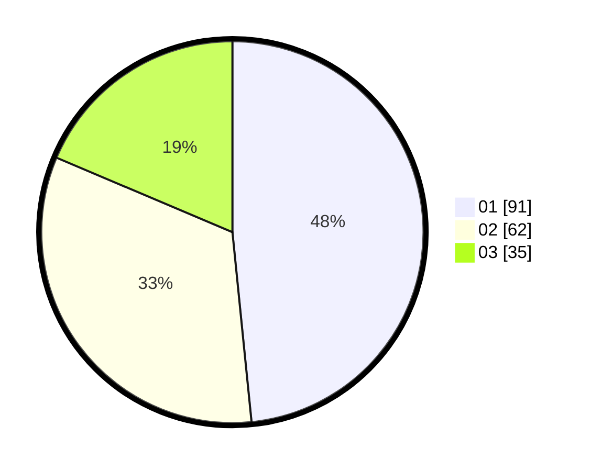

# Hasil

Hasil perolehan suara paslon dapat dilihat pada file paslon-01.txt, paslon-02.txt, dan paslon-03.txt.

Jika tidak ada, artinya data tersebut belum ada pada SIREKAP.

## Perolehan Suara

 * Paslon 01: **91**.
 * Paslon 02: **62**.
 * Paslon 03: **35**.

## Foto C Plano

https://sirekap-obj-formc.kpu.go.id/87d9/pemilu/ppwp/31/73/08/10/05/3173081005109-20240214-203817--f0a9c252-d9eb-4761-9f8e-1476694fd6ed.jpg

https://sirekap-obj-formc.kpu.go.id/87d9/pemilu/ppwp/31/73/08/10/05/3173081005109-20240214-221333--75be67fd-2eb4-443b-afa1-05eec6b46b24.jpg

https://sirekap-obj-formc.kpu.go.id/87d9/pemilu/ppwp/31/73/08/10/05/3173081005109-20240214-221754--92f67ff6-2764-489c-b787-a8ecef21912a.jpg

## DATA PEMILIH TETAP

Jumlah pemilih dalam DPT: **224**.
 * L: **107**.
 * P: **117**.

## DATA PENGGUNA HAK PILIH

Jumlah pengguna hak pilih dalam DPT: **187**.
 * L: **85**.
 * P: **102**.

Jumlah pengguna hak pilih dalam DPTb: **2**.
 * L: **1**.
 * P: **1**.

Jumlah pengguna hak pilih dalam DPK: **1**.
 * L: **0**.
 * P: **1**.

Jumlah pengguna hak pilih: **190**.
 * L: **86**.
 * P: **104**.

## JUMLAH SUARA SAH DAN TIDAK SAH

JUMLAH SELURUH SUARA SAH: **188**.

JUMLAH SUARA TIDAK SAH: **2**.

JUMLAH SELURUH SUARA SAH DAN SUARA TIDAK SAH: **190**.
