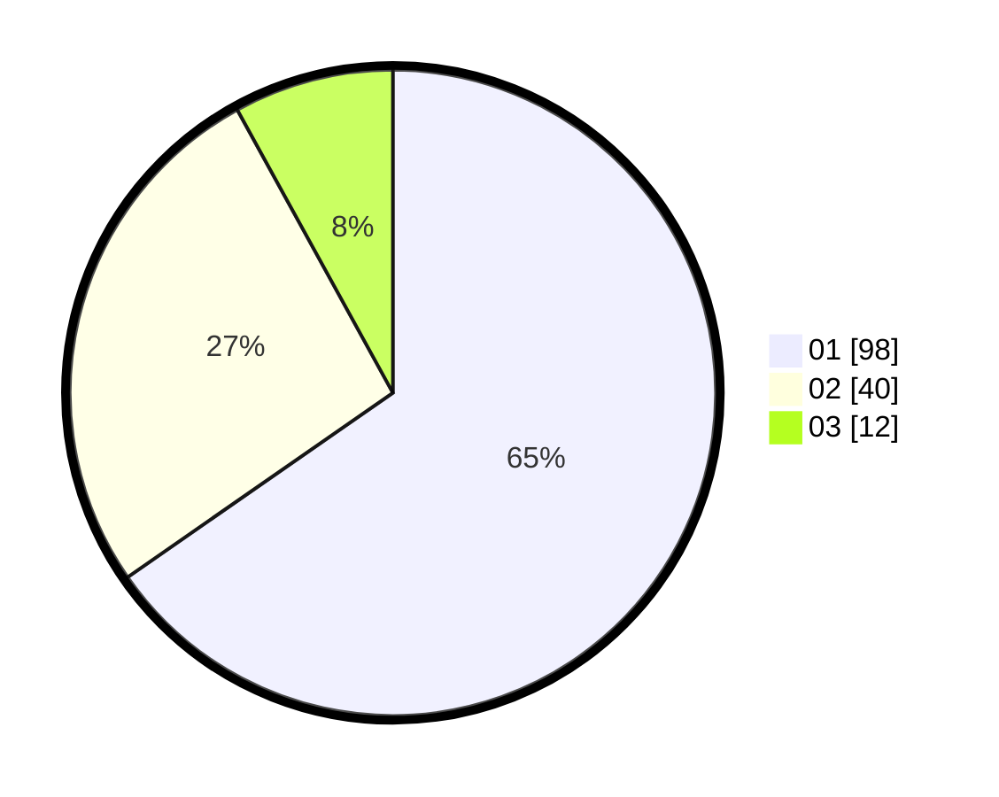

# Hasil

Hasil perolehan suara paslon dapat dilihat pada file paslon-01.txt, paslon-02.txt, dan paslon-03.txt.

Jika tidak ada, artinya data tersebut belum ada pada SIREKAP.

## Perolehan Suara

 * Paslon 01: **98**.
 * Paslon 02: **40**.
 * Paslon 03: **12**.

## Foto C Plano

https://sirekap-obj-formc.kpu.go.id/3968/pemilu/ppwp/31/73/08/10/05/3173081005111-20240214-190241--0045924f-5e45-4261-ba86-6af7c57fc85f.jpg

https://sirekap-obj-formc.kpu.go.id/3968/pemilu/ppwp/31/73/08/10/05/3173081005111-20240214-190249--91fb0047-07a7-4f74-ac4a-4e8cd442684d.jpg
