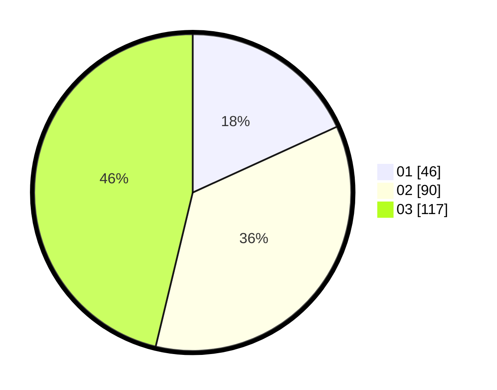

# Hasil

Hasil perolehan suara paslon dapat dilihat pada file paslon-01.txt, paslon-02.txt, dan paslon-03.txt.

Jika tidak ada, artinya data tersebut belum ada pada SIREKAP.

## Perolehan Suara

 * Paslon 01: **46**.
 * Paslon 02: **90**.
 * Paslon 03: **117**.

## Foto C Plano

https://sirekap-obj-formc.kpu.go.id/b353/pemilu/ppwp/31/73/08/10/05/3173081005116-20240214-234554--57e7151b-077d-4edd-8c1a-db76a699020a.jpg

https://sirekap-obj-formc.kpu.go.id/b353/pemilu/ppwp/31/73/08/10/05/3173081005116-20240214-215904--9ce7c5b2-800f-4afd-9264-9061552b581f.jpg

https://sirekap-obj-formc.kpu.go.id/b353/pemilu/ppwp/31/73/08/10/05/3173081005116-20240214-215927--22f991f2-61d1-492e-87c7-937b3f32bce3.jpg
